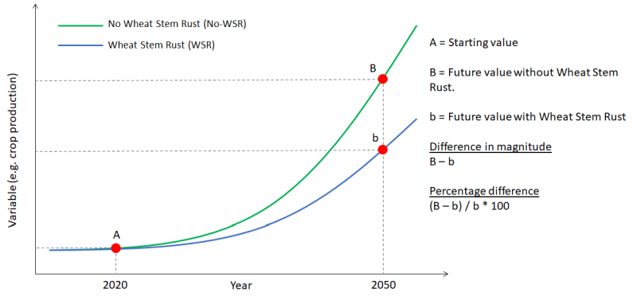

```{r setup, include=FALSE}
knitr::opts_chunk$set(echo = FALSE,
                      message = FALSE,
                      warning = FALSE)
library(tidyverse)
library(patchwork)
library(kableExtra)
# library(raster)
# library(rgdal)
library(flextable)
# library(officer)
library(ggrepel)
# library("readxl")
#===========================================================================
shift_legend2 <- function(p) {
  # ...
  # to grob
  gp <- ggplotGrob(p)
  facet.panels <- grep("^panel", gp[["layout"]][["name"]])
  empty.facet.panels <- sapply(facet.panels, function(i) "zeroGrob" %in% class(gp[["grobs"]][[i]]))
  empty.facet.panels <- facet.panels[empty.facet.panels]
  
  # establish name of empty panels
  empty.facet.panels <- gp[["layout"]][empty.facet.panels, ]
  names <- empty.facet.panels$name
  # example of names:
  #[1] "panel-3-2" "panel-3-3"
  
  # now we just need a simple call to reposition the legend
  #lemon::reposition_legend(p, 'center', panel=names)
  p_out <- lemon::reposition_legend(p, 'center', panel=names)
  #class(lemon::reposition_legend(p, 'center', panel=names))
  return(p_out)
}
#===========================================================================

```


```{r, echo=FALSE}

#=============================================================================
# Define function to process df
process_df <- function(this_df, this_commodVec, paramVec){
  # We want HH demand disaggregated by rural, urban
  this_df <- subset(this_df, impactparameter != "QFXAgg -- Household Demand")
  this_df$impactparameter <- gsub("^.*\\-- ", "", this_df$impactparameter)
  # this_df$Region <- gsub("\\-.*", "", this_df$Country)
  # this_df$Country <- gsub("^.*\\-", "", this_df$Country)
  this_df$impactparameter <- gsub("Total ", "", this_df$impactparameter)
  this_df$impactparameter[which(this_df$impactparameter == "Demand")] <- "Total Demand"
  this_df$impactparameter <- gsub("PopulationAtRiskXagg - ", "", this_df$impactparameter)
  this_df$impactparameter[grep("PcKcal", this_df$impactparameter)] <- "Availability\n(kcal/capita/day)"
  this_df$impactparameter <- gsub("Malnurished", "Undernourished", this_df$impactparameter)
  
  this_df$region[which(this_df$region == "SSA")] <- "Africa South\nof the Sahara"
  this_df$region[which(this_df$region == "SAS")] <- "South Asia"
  this_df$region[which(this_df$region == "NAM")] <- "N. America"
  this_df$region[which(this_df$region == "MEN")] <- "West Asia &\nNorth Africa"
  this_df$region[which(this_df$region == "LAC")] <- "Latin America\n&Caribbean"
  this_df$region[which(this_df$region == "FSU")] <- "Former USSR"
  this_df$region[which(this_df$region == "EUR")] <- "Europe"
  this_df$region[which(this_df$region == "EAP")] <- "East Asia &\nPacific"
    this_df$region[which(this_df$region == "WLD")] <- "World"
  # #---
  # these_systems <- c("-", "total", "Urban", "rural")
  # #---
  # this_df <- subset(this_df, productiontype %in% these_systems)
  # #---
  # Create total kcal/capita/day
  this_dfKcal <- subset(this_df, impactparameter == "Availability\n(kcal/capita/day)" &
                          commodity %in% c("CER", "OLS", "AllA", "R&T",
                                           "F&V", "PUL", "SGR"))
  this_dfKcal <- this_dfKcal %>% group_by(impactparameter, scenario, region, productiontype, year) %>% summarise(Val = sum(Val)) %>% as.data.frame()
  this_dfKcal$commodity <- "Total kcal/capita/day"
  this_dfKcal <- this_dfKcal[, colnames(this_df)]
  #---
#  this_df <- subset(this_df, commodity %in% this_commodVec)
  #---
  # Disaggregate HH demand into rural and urban
  ind_HHdemRur <- which(this_df$impactparameter == "Household Demand" &
                          this_df$productiontype == "rural")
  ind_HHdemUrb <- which(this_df$impactparameter == "Household Demand" &
                          this_df$productiontype == "Urban")
  this_df$impactparameter[ind_HHdemRur] <- "HH Demand Rural"
  this_df$impactparameter[ind_HHdemUrb] <- "HH Demand Urban"
  #---
  # Create "other cereals" commodity
  if("CER" %in% this_commodVec){
     these_CERs <- this_commodVec[grep("CER", this_commodVec)]
  this_dfCER <- subset(this_df, commodity %in% these_CERs)
  this_df <- subset(this_df, !(commodity %in% these_CERs))
  this_dfCER <- this_dfCER %>% spread(commodity, Val)
  these_cols <- which(colnames(this_dfCER) != "CER")
  these_cols <- these_cols[these_cols > 6]
  if(length(these_cols) > 1){
      this_dfCER$`Other cereals` <- this_dfCER$CER - rowSums(this_dfCER[, these_cols])
  }else{
    this_dfCER$`Other cereals` <- this_dfCER$CER - this_dfCER[, these_cols]
  }
  this_dfCER$CER <- NULL
  
  gathercols <- colnames(this_dfCER)[6:ncol(this_dfCER)]
  this_dfCER <- this_dfCER %>% gather_("commodity", "Val", gathercols)
  this_dfCER <- this_dfCER[, colnames(this_df)]

  ind_otherCer <- which(this_dfCER$commodity == "Other cereals")
  ind_yd <- which(this_dfCER$impactparameter == "Yield")
  ind_rm <- intersect(ind_otherCer, ind_yd)
  this_dfCER <- this_dfCER[-ind_rm, ]
  
  this_dfotherCERYd <- subset(this_dfCER, impactparameter %in% c("Area", "Production") & commodity == "Other cereals")
  #this_dfCER <- subset(this_dfCER, impactparameter != "Yield")
  this_dfotherCERYd$productiontype <- NULL
  this_dfotherCERYd <- this_dfotherCERYd %>% spread(impactparameter, Val)
  this_dfotherCERYd$Val <- this_dfotherCERYd$Production / this_dfotherCERYd$Area
  this_dfotherCERYd$productiontype <- "total"
  this_dfotherCERYd$impactparameter <- "Yield"
  this_dfotherCERYd <- this_dfotherCERYd[, colnames(this_dfCER)]
  this_dfCER <- rbind(this_dfCER, this_dfotherCERYd)
  
 
  }
  #---
  # # Create "other pulses"
  # these_PULs <- these_commods[grep("PUL", these_commods)]
  # if(length(these_PULs) != 1){
  #   this_dfPUL <- subset(this_df, Commodity %in% these_PULs)
  #   this_df <- subset(this_df, !(Commodity %in% these_PULs))
  #   this_dfPUL <- this_dfPUL %>% spread(Commodity, Val)
  #   these_cols <- which(colnames(this_dfPUL) != "PUL")
  #   these_cols <- these_cols[these_cols > 6]
  #   if(length(these_cols)  >  1){
  #     this_dfPUL$`Other pulses` <- this_dfPUL$PUL - rowSums(this_dfPUL[, these_cols])
  #   }else{
  #     this_dfPUL$`Other pulses` <- this_dfPUL$PUL - this_dfPUL[, these_cols]
  #   }
  #   this_dfPUL$PUL <- NULL
  #   gathercols <- colnames(this_dfPUL)[7:ncol(this_dfPUL)]
  #   this_dfPUL <- this_dfPUL %>% gather_("Commodity", "Val", gathercols)
  #   this_dfPUL <- this_dfPUL[, colnames(this_df)]
  #   
  # }else{
  #   this_dfPUL <- NULL
  # }
  # #---
  # # Create "other roots & tubers"
  # these_RnTs <- these_commods[grep("R&T", these_commods)]
  # if(length(these_RnTs) != 1){
  #   this_dfRnT <- subset(this_df, Commodity %in% these_RnTs)
  #   this_df <- subset(this_df, !(Commodity %in% these_RnTs))
  #   this_dfRnT <- this_dfRnT %>% spread(Commodity, Val)
  #   these_cols <- which(colnames(this_dfRnT) != "R&T")
  #   these_cols <- these_cols[these_cols > 6]
  #   if(length(these_cols) > 1){
  #     this_dfRnT$`Other roots\n& tubers` <- this_dfRnT$`R&T` - rowSums(this_dfRnT[, these_cols])
  #   }else{
  #     this_dfRnT$`Other roots\n& tubers` <- this_dfRnT$`R&T` - this_dfRnT[, these_cols]
  #   }
  #   this_dfRnT$RnT <- NULL
  #   gathercols <- colnames(this_dfRnT)[7:ncol(this_dfRnT)]
  #   this_dfRnT <- this_dfRnT %>% gather_("Commodity", "Val", gathercols)
  #   this_dfRnT <- this_dfRnT[, colnames(this_df)]
  #   
  # }else{
  #   this_dfRnT <- NULL
  # }
  #---
  # Create fruit commodity
  # this_dfFnV <- subset(this_df, Commodity %in% c("F&V", "Vegetables"))
  # this_df <- subset(this_df, !(Commodity %in% c("F&V", "Vegetables")))
  # this_dfFnV <- this_dfFnV %>% spread(Commodity, Val)
  # this_dfFnV$Fruit <- this_dfFnV$`F&V` - this_dfFnV$Vegetables
  # this_dfFnV$`F&V` <- NULL
  # this_dfFnV <- this_dfFnV %>% gather(Commodity, Val, Vegetables:Fruit)
  # this_dfFnV <- this_dfFnV[, colnames(this_df)]
  #---
  # # Create "other livestock products" commodity
  # these_AMTs <- these_commods[grep("AMT", these_commods)]
  # these_AMTs <- c(these_AMTs, "AllA")
  # this_dfAMT <- subset(this_df, Commodity %in% these_AMTs)
  # this_df <- subset(this_df, !(Commodity %in% these_AMTs))
  # this_dfAMT <- this_dfAMT %>% spread(Commodity, Val)
  # these_cols <- which(colnames(this_dfAMT) != "AllA")
  # these_cols <- these_cols[these_cols > 6]
  # if(length(these_cols) > 1){
  #   this_dfAMT$`Other animal\nproducts` <- this_dfAMT$AllA - rowSums(this_dfAMT[, these_cols])
  # }else{
  #   this_dfAMT$`Other animal\nproducts` <- this_dfAMT$`AllA` - this_dfAMT[, these_cols]
  # }
  # this_dfAMT$AMT <- NULL
  # gathercols <- colnames(this_dfAMT)[7:ncol(this_dfAMT)]
  # this_dfAMT <- this_dfAMT %>% gather_("Commodity", "Val", gathercols)
  # this_dfAMT <- this_dfAMT[, colnames(this_df)]
  #---
  # Unite new vars with data
  if("CER" %in% this_commodVec){
      list_df <- list(this_df, this_dfKcal, this_dfCER)

  }else{
    list_df <- list(this_df, this_dfKcal)
  }
  this_df <- as.data.frame(do.call(rbind, list_df))
  #---
  # Commodity names
  this_df$commodity <- gsub("^.*\\-", "", this_df$commodity)
  # Relabel commodities
  u <- this_df$commodity
  this_df$commodity[grep("SGR", u)] <- "Sugar"
  this_df$commodity[grep("AllA", u)] <- "Animal products"
  #this_df$commodity[grep("CER", u)] <- "Cereals"
  this_df$commodity[grep("R&T", u)] <- "Roots & tubers"
  this_df$commodity[grep("OLS", u)] <- "Oilseeds"
  this_df$commodity[grep("OIL", u)] <- "Vegetable oils"
  this_df$commodity[grep("PUL", u)] <- "Pulses"
  this_df$commodity[grep("F&V", u)] <- "Fruits &\nvegetables"
  this_df$commodity[grep("Lamb", u)] <- "Small\nruminants"
  #---
  # Create SSP, RCP, and GCM variables
  #this_df$SSP <- paste("SSP", i)
  #this_df$RCP <- NA
  # this_df$RCP[grep("4.5", this_df$Scenario)] <- "RCP 4.5"
  # this_df$RCP[grep("8.5", this_df$Scenario)] <- "RCP 8.5"
  # this_df$RCP[grep("NoCC", this_df$Scenario)] <- "NoCC"
  # this_df$GCM <- gsub("\\_.*", "", this_df$Scenario)
  
  this_df$productiontype <- NULL
  
  this_df$scenario[grep("NoWSR", this_df$scenario)] <- "CC No WSR"
  this_df$scenario[grep("WSRwrst", this_df$scenario)] <- "CC+WSR (worst case)"
  this_df$year <- as.integer(this_df$year)
  this_dfCC <- subset(this_df, scenario == "CC No WSR")
  this_dfCCWSRwrst <- subset(this_df, scenario == "CC+WSR (worst case)")
  this_dfCCWSRbest <- subset(this_df, !(scenario %in% c("CC",
                                                    "CC+WSR (worst case)")))
  this_dfCCWSRbest$scenario <- "CC+WSR (best case)"
  # This is throwing a weird warning message. Ignore it.
  # https://stackoverflow.com/questions/62140483/how-to-interpret-dplyr-message-summarise-regrouping-output-by-x-override
  this_dfCC <- this_dfCC %>% group_by(region, impactparameter, commodity, year, scenario) %>%
    summarise(Val = mean(Val, na.rm = T)) %>%
    as.data.frame
  this_dfCCWSRbest <- this_dfCCWSRbest %>% group_by(region, impactparameter, commodity, year, scenario) %>%
    summarise(Val = mean(Val, na.rm = T)) %>%
    as.data.frame
  this_dfCCWSRwrst <- this_dfCCWSRwrst %>% group_by(region, impactparameter, commodity, year, scenario) %>%
    summarise(Val = mean(Val, na.rm = T)) %>%
    as.data.frame
  
    list_df <- list(this_dfCC, this_dfCCWSRbest, this_dfCCWSRwrst)
    df_out <- as.data.frame(do.call(rbind, list_df))
    
  # df_out <- plyr::join_all(list_df, by = c("region",
  #                                          "impactparameter",
  #                                          "commodity",
  #                                          "year"))
  

  return(df_out)
  
}
#=============================================================================
#=============================================================================
#=============================================================================


supplyParams <- c("QSXAgg -- Total Production",
                  "TAreaXAgg -- Total Area",
                  "TYldXAgg -- Total Yield",
                  "AnmlNumXAgg -- Animal Numbers",
                  "AnmlYldXAgg -- Animal Yield")

demandParams <- c("QHDXAgg -- Household Demand",
                  "QEXAgg -- Export",
                  "QLXAgg -- Livestock Feed Demand",
                  "QINTXAgg -- Intermediate Demand",
                  #"QOTHRXAgg -- Other Demand",
                  "QDXAgg -- Total Demand")

foodAvailParams <- c("PerCapKCalCXAgg -- PcKcal by Commodity",
                     "PopulationAtRiskXagg - Pop at Risk of Hunger",
                     "TotalMalnourishedXagg -- Malnurished Children",
                     "QMSHXAgg -- Import Share of Demand")

# supply_params <- c("Area",
#                    "Production",
#                    "Yield",
#                    "Animal Numbers",
#                    "Animal Yield")

# demand_params <- c("Household Demand",
#                    "Export",
#                    "Livestock Feed Demand",
#                    "Intermediate Demand",
#                    "Other Demand")
# foodSec_params <- c("Availability\n(kcal/capita/day)",
#                     "Share at Risk of Hunger",
#                     "undernourished Children",
#                     "Import Share of Demand")

paramVec <- c(supplyParams,
              demandParams,
              foodAvailParams)


commodVec <- c("CER-Wheat",
                  "CER-Maize",
                  "CER-Millet",
                  "CER-Rice",
                  "CER-Barley",
                  "CER-Sorghum",
                  "CER-Other Cereals"
                  #"SGR",
                  #"F&V",
                  #"COT",
                  #"AllA"
               )

commodVec_overView <- c("CER-Wheat",
                  "CER",
                  "R&T",
                  "PUL",
                  "OLS")

forTotKcalPcap <- c("CER", "OLS", "AllA", "R&T",
                                           "F&V", "PUL", "SGR")

regionVec <- c("SSA", "EUR", "LAC", "NAM", "MEN", "EAP", "SAS", "FSU", "WLD")
#--------------------------------------------------------------------------

this_folder <- "E:/BSCHIEK/"
this_subfolder <- "2Blades WSR IMPACT/"
this_fileName <- "2BladesWSR.csv"
this_filePath <- paste0(this_folder, this_subfolder, this_fileName)
df_raw <- read.csv(this_filePath, stringsAsFactors = F)

this_commodVec <- unique(c(commodVec, forTotKcalPcap, "-"))
this_df <- subset(df_raw, impactparameter %in% paramVec &
                   region %in% regionVec &
                   commodity %in% this_commodVec)
df <- process_df(this_df, commodVec, paramVec)

this_commodVec <- unique(c(commodVec_overView, forTotKcalPcap, "-"))
this_df <- subset(df_raw, impactparameter %in% paramVec &
                   region %in% regionVec &
                   commodity %in% this_commodVec)
df_overView <- process_df(this_df, commodVec_overView, paramVec)
#rm(df_raw, this_df)


paramsList <- list(supplyParams, demandParams, foodAvailParams)
for(i in 1:length(paramsList)){
  this_paramVec <- paramsList[[i]]
  this_paramVec <- gsub("^.*\\-- ", "", this_paramVec)
  this_paramVec <- gsub("Total ", "", this_paramVec)
  this_paramVec <- gsub("PopulationAtRiskXagg - ", "", this_paramVec)
  this_paramVec[grep("PcKcal", this_paramVec)] <- "Availability\n(kcal/capita/day)"
  this_paramVec <- gsub("Malnurished", "Undernourished", this_paramVec)
  paramsList[[i]] <- this_paramVec
}
supplyParams <- paramsList[[1]]
demandParams <- paramsList[[2]]
foodAvailParams <- paramsList[[3]]
demandParams <- c("HH Demand Rural",
                   "HH Demand Urban",
                   "Export",
                   "Livestock Feed Demand",
                   "Intermediate Demand",
                   # "Other Demand",
                  "Total Demand")

colnames(df) <- c("Region", "param", "Commodity", "Year", "Scenario", "Val") 
df <- subset(df, Year != 2005 & Commodity != "CER")

colnames(df_overView) <- c("Region", "param", "Commodity", "Year", "Scenario", "Val") 
df_overView <- subset(df_overView, Year != 2005)

#==========================================================================
# Plotting parameters
title_size <- 9
subtitle_size <- 8
legendText_size <- 8
axisText_size <- 8
axisTitle_size <- 8
facetTitle_size <- 8
cellText_size <- 3
#==========================================================================
theseCommods <- c("Pulses", "Wheat", "Other cereals", "Oilseeds", "Roots & tubers")


```

#### Acknowledgments

Special thanks to Dave Hodson, Mesut Keser, and Kumarse Nazari for their valuable input at various stages of the design and execution of this study.

# Executive summary

```{r, ref.label="mentionSupVars", echo = FALSE}
```

```{r, ref.label="mentionDemVars", echo = FALSE}
```

```{r, ref.label="mentionFoodSecVars", echo = FALSE}
```
<!-- Wheat stem rust is bad, but how bad? In order to address this, an IMPACT study was conducted. The results are presented below. Yield shocks introduced in 65 countries based on consultations with 11 wheat experts. Indirect yield shocks too. A best and worst case scenario were run, as well as a baseline "No-WSR" scenario. Results are presented in terms of their deviation from the No-WSR baseline. Results are presented as a range from the deviation in the best case WSR scenario to the deviation in the worst case WSR scenario. Etc. Exogenous yield shock of 5-15% and double in the worst case scenario. (This means 5% lower given no adjustments to management). This is a parsimonious study "first order approximation"...WSR strikes for five year periods. both rainfed and irrigated. Arguably, the real usefulness of modeling exercises such as this one lies not so much in the answers it gives as in the questions it helps us to ask. A more realistic parameterization . -->

Wheat stem rust, a disease that was effectively eradicated during the Green Revolution, has made an alarming comeback over the past two decades. Estimates of the future spread of wheat stem rust and its impact on global wheat production have so far focused on the genomic and agroclimatic aspects of the disease. The present study assesses the potential global economic impacts of wheat stem rust out to 2050 using an agricultural sector equilibrium model called IMPACT. Exogenous wheat stem rust yield shocks for susceptible countries are fed into the model based on information gathered from 11 international wheat experts. An additional yield shock is introduced to capture indirect wheat yield loss due to the higher fungicide costs incurred to protect crops from the disease. IMPACT then models the global economic repercussions of the resulting supply-demand imbalances, while also accounting for climate change and assumptions regarding future GDP growth and demographic trends. Best and worst case scenarios are compared against a baseline "no stem rust" scenario.

#### Summary of supply side impacts

The modeling suggests that the worldwide spread of wheat stem rust may result in a global cumulative wheat production shortfall of `r (prodCumWLDwhea2035B)` to `r (prodCumWLDwhea2035W)` thousand metric tons (best to worst case) by 2035, and `r (prodCumWLDwhea2050B)/1000` to `r (prodCumWLDwhea2050W)/1000` million metric tons by 2050. The shortfall is especially sharp in the West Asia & North African and Former USSR regions (`r prodWANAwhea2035B` to `r prodWANAwhea2035W` thousand metric tons and `r prodFSUwhea2035B` to `r prodFSUwhea2035W` thousand metric tons in 2035, respectively). The shortfall is not greater due to a high wheat price incentive (due to the wheat scarcity resulting from wheat stem rust) drawing resources and land from other crops to offset the disease's biophysical impacts. This is projected to result in a negative spillover effect in other cereal markets, causing a production shortfall there as well. The projected cumulative global production shortfall of both wheat and other cereals is `r (prodCumWLDocer2035B+prodCumWLDwhea2035B)/1000` to `r (prodCumWLDwhea2035W+prodCumWLDocer2035W)/1000` million metric tons by 2035, and `r (prodCumWLDocer2050B+prodCumWLDwhea2050B)/1000`-`r (prodCumWLDwhea2050W+prodCumWLDocer2050W)/1000` million metric tons by 2050. 

#### Summary of demand side impacts

The projected supply side impacts of wheat stem rust are reflected in a lower wheat demand outlook, especially lower wheat export demand, due to the disease's reshuffling effect on countries' comparative advantages in trade and agriculture. Regions currently enjoying a comparative advantage in wheat trade, but with a high anticipated incidence of wheat stem rust, are projected to export considerably less than under the no wheat stem rust baseline scenario, while wheat growing regions with a relatively lower anticipated incidence of wheat stem rust are projected to pick up the slack, increasing exports above the no wheat stem rust baseline. Even so, projected reductions in export demand outweigh projected increases, such that, by 2035, there could be `r expDemWLDwhea2035B` to `r expDemWLDwhea2035W` thousand metric tons less wheat circulating on the international market.

Household wheat demand is also projected to fall considerably due to wheat stem rust. Globally, 2035 wheat consumption is projected to be `r totDemWLDwhea2035B` to `r totDemWLDwhea2035W` thousand metric tons lower than the no wheat stem rust baseline. This projected decline in wheat consumption is particularly concerning because it is generally not compensated by a projected increase in the consumption of other commodities. In countries where wheat export demand is projected to increase above the no wheat stem rust baseline---particularly in Europe and South Asia---this simultaneous decline in household consumption may imply a serious food security risk.

#### Summary of food security impacts

The projected supply-demand imbalances resulting from the global spread of wheat stem rust are projected to result in an increase of `r uChldWLD2035B` to `r uChldWLD2035W` thousand undernourished children, and `r popRskWLD2035B` to `r popRskWLD2035W` thousand more people at risk of hunger, by 2035. By 2050, these figures are projected to increase to `r uChldWLD2050B` to `r uChldWLD2050W` thousand undernourished children, and `r popRskWLD2050B/1000` to `r popRskWLD2050W/1000` million people at risk of hunger, if the global spread of wheat stem rust is not brought under control. The projected reduction in food security is especially pronounced in South Asia, a region with a relatively small anticipated incidence of the disease. This is explained by South Asia's rising comparative advantage in wheat in the face of the projected decline in exports from the Former USSR, West Asia & North Africa, and East Asia & Pacific regions. The rising export price incentive diverts South Asian wheat from an underserved domestic market to the export market, which also remains underserved in spite of this diversion of resources.

# Introduction

#### Wheat stem rust

Wheat stem rust or black rust (hereafter "WSR"), caused by the fungus _Puccinia graminis_ Pers. f. sp. _tritici_, posed a serious threat to global wheat production prior to the 1960s (see Roelfs [-@roelfs1992rust] for detailed pathology). The threat subsided thereafter with the development of resistant cultivars during the Green Revolution. However, new races of the WSR causing fungus have emerged that exhibit combined virulence to resistance genes in the most widely grown wheat (_Triticum aestivium_) varieties. The first new race to be detected, designated Ug99, was identified in Uganda in 1998, and quickly spread to the rest of East Africa and Southern Africa, as well as Egypt, Yemen, Turkey, and Iran [@singh2015emergence; @mert2012determination]. More recently, WSR has been detected in Russia [@sibikeev2016likely], as well as in the UK, Germany, Sweden, Denmark, and Sicily [@lewis2018potential]. Yield loss on severely infected fields has been documented as high as 80% [@huerta2014rusts]. A recently discovered race, called TKTTF, has caused yield loss of up to 100% on fields in Ethiopia [@singh2015emergence]. It is estimated that 80% of the world's wheat is highly susceptible to these new races [@ayliffe2008durable].

_Puccinia graminis_ requires specific conditions of prolonged warmth, humidity, and solar radiation to thrive [@roelfs1992rust]. With climate change, ideal conditions for the WSR causing fungus, as well as other pests and pathogens, appear to be extending to higher latitudes [@bebber2013crop], a trend that could continue into the future, according to future climate projections [@prank2019climate].

#### Existing estimates of yield loss due to wheat stem rust

Crude estimates of potential wheat yield loss due to WSR range from disastrous to catastrophic. One study, for example, projects future global WSR induced production losses at \$7.6-\$53.7 billion, annually [@fisher2012emerging; @beddow2013measuring]. The upper bound of this estimate is roughly one third of the current annual value of global wheat production, and close to one fifth of global agricultural GDP. Donors are unlikely to take such hyperbole seriously [@alston2000meta; @hurley2016returns]. More rigorous estimates are considerably lower, but still alarming. In a counterfactual historical study, Pardey et al. estimate a cumulative global wheat production shortfall of 306 million metric tons over the 48 year period 1961-2009 (or about 6 million metric tons per year) if WSR-resistant varieties had not been developed during the Green Revolution [-@pardey2013right; see also @beddow2013measuring]. Based on a large, international survey of crop experts, Savary et al. [-@savary2019global] project a future WSR induced 9% wheat yield loss across Africa South of the Sahara, and little impact elsewhere.

Existing studies focus on the genomic and agroclimatic dimensions of WSR induced production shortfalls, without explicitly considering the role that markets might play in aggravating or offsetting these shortfalls. To address this gap, the present study explicitly models the economic response to the potential global spread of WSR. By accounting for markets, the study accounts for the freedom of farmers to offset agroclimatic adversity by investing more land and inputs in production, or by switching to alternative crops. Such decisions, made in response to price signals, may be profitable and succeed in offsetting agroclimatic adversity at the farm level to some degree, but may also result in aggregate production shortfalls at the country or region scale. They may also incur spillover effects in other commodity markets, as land and resources are drawn away from the production of those commodities in order to confront the WSR threat.

#### The present study

In order to model this complex, dynamic, global interplay of agroclimatic and economic forces, the International Model for Policy Analysis of Agricultural Commodities and Trade (IMPACT) is used. IMPACT, developed at the International Food Policy Research Institute, is not a single model, but rather a suite of models organized into three modules: a crop modeling module, a climate change module, and a multimarket equilibrium module covering more than 50 agricultural commodities. Yield is thus modeled as a function of both agroclimatic and economic factors. This means that exogenous impacts on biophysical factors (as a result of climate change or disease outbreak, for example) can be offset by the farmer's ability to adapt to the biophysical stress of climate change by altering input levels or switching to alternative crops, in response to price signals. Future exogenous yield gains due to ongoing improvements in germplasm and farm management are also taken into account.

IMPACT also allows for the introduction of user-defined exogenous yield shocks. In the present study, exogenous wheat yield shocks are introduced at five year intervals to simulate WSR outbreaks. The magnitude and location of these shocks are based on consultations with 11 international wheat experts who were contacted for this study. Prices then adjust to resulting supply-demand imbalances and influence farmer planting and management decisions through the multi-market equilibrium model.

Some of the experts consulted expect no WSR outbreaks in their geographic area of expertise due to the adoption of newly available WSR-resistant varieties and/or increased fungicide use. However, it stands to reason that, even in these cases, some indirect yield loss may result from higher fungicide costs. (Economic yields are a function not only of agroclimatic factors but also prices.) To model indirect yield loss due to higher input costs, an additional exogenous yield shock is introduced based on the expected WSR-induced fungicide cost increase, and on IMPACT's input elasticities of wheat yield for each country. The expected fungicide cost increase for a given country is extrapolated from FAO fungicide use data for that country.

The potential global economic impacts of WSR are modeled out to 2050. A "no wheat stem rust" counterfactual scenario (No-WSR) is also modeled as a baseline for comparison. Both the WSR and No-WSR scenarios take account of climate change, as well as assumptions regarding future GDP growth, technological advances, and demographic trends (the "Shared Socioeconomic Pathway"). The future impacts of WSR on supply, demand, and food security indicators are presented and discussed in terms of the difference between the WSR and No-WSR magnitudes (Figure ). Impacts in percentage terms are included in the Appendix.

```{r, fig.show='hold', fig.width=6, fig.height=5, fig.align='center', ft.align = "center", fig.cap="\\label{fig:graphicalAid}How to interpret IMPACT output.", echo=FALSE}



```
<!-- #### Organization of the report -->
<!-- * The remaining sections are organized as follows: Details regarding the method are presented in the following section.  -->

# Method

#### Expert consultation to determine direct yield loss due to wheat stem rust

The potential spread, severity, and frequency of future WSR outbreaks was assessed based on consultations with 11 international wheat experts. The consultation was conducted by means of a questionnaire sent to experts within the Bioversity-CIAT Alliance extended network of partners. The first draft of the questionnaire was written by the author of the present report. Before being sent out to wheat experts, the questionnaire was reviewed and substantially modified by Dave Hodson, a Senior Scientist at CIMMYT and long time coordinator of the Global Wheat Rust Monitoring System. Wheat experts from around the world returned their completed questionnaires over the period April to September of 2021. Once the responses were in, Dave Hodson again participated in their interpretation and synthesis for introduction into the IMPACT model. This included some extrapolations to cover important wheat growing countries not explicitly mentioned in the responses. The results of this consultation, which ultimately covered 65 countries, are summarized in Table 1. The 11 expert responses are available in the supplemental materials folder accompanying this study. In the present study, these responses are interpreted as the "best case scenario" of WSR spread and severity. A "worst case scenario" is also modeled wherein the expert estimates of WSR direct yield loss are doubled, or raised to 5-10% in cases where experts expect 0% yield loss (Table 2).

[Table 1]

[Table 2]

#### Calculating indirect yield loss due to higher fungicide costs

An additional yield shock is introduced to capture wheat yield loss due to the higher cost of protecting wheat fields from WSR. Increases in fungicide cost are loosely extrapolated from FAO data (Figure xx, top panel). With the exception of Iran, Kyrgyzstan, and Turkmenistan, the FAO data generally indicate a trend of rising in fungicide (and bactericide) use per unit crop area over the past 20 years. The general rule followed in assigning future increases in fungicide costs is as follows: For countries that have seen a large (>200) percentage increase in fungicide use per hectare over the past 20 years, a cumulative 10% increase every five years is assumed in the best case scenario. For countries that have seen a small percentage increase (or percentage decrease) in fungicide use per hectare over the past 20 years, a cumulative 15% increase every five years is assumed in the best case scenario. In the worst case scenario, these numbers are doubled. The fungicide cost increase is applied primarily to wheat producing countries where experts indicated little or no likelihood of WSR outbreaks in the next 15 years (due to existing protection measures).

[fungicide/wheat graphic]

This is a very loose extrapolation because the FAO data do not tell us how much of the fungicide use is on wheat fields. In the case of Australia, where wheat has consistently accounted for about half of all cropland over the past 20 years (Figure xx, bottom panel), the steep rise in fungicide use may be attributed to wheat fields with greater confidence than, say, in the case of Southern Africa or the USA, where wheat accounts for a relatively small and declining portion of total cropland.

In the modeling, the percentage increase in fungicide cost is introduced as a percentage increase in fungicide price. This is a way of saying that "the cost per hectare of maintaining the baseline level of protection (i.e., prior to WSR), will increase by x%." The indirect yield shock due to this fungicide "price increase" is then calculated based on the country level input wheat yield elasticities hard coded into IMPACT. These elasticities were specified by country experts when IMPACT was created. They are generally quite small, resulting in indirect wheat yield shocks of -0.1% to -1.5%.

#### IMPACT analysis

In IMPACT, the direct WSR yield shocks elicited from experts were introduced on both rainfed and irrigated fields at five year intervals, starting in 2025. (Wheat expert respondents indicated a likely WSR outbreak frequency of 3-10 years.) Due to modeling constraints, each outbreak was assumed to last for five years. Indirect yield shocks resulting from higher fungicide costs were introduced annually, starting in 2020. IMPACT computed the resulting supply-demand perturbations across more than 50 commodity markets and 148 countries, out to 2050.

Assumptions regarding future population growth, GDP growth, technology advancement, and intergovernmental action (or inaction) on climate change are captured in the assumed Shared Socioeconomic Pathway (SSP). In the present study, SSP3 is assumed. This is a pessimistic scenario "characterized by increasing nationalism with greater levels of conflict and challenges to global and regional cooperation. Barriers to trade increase, and countries tend to look inward at the expense of global cooperation. There are lower levels of technological change. Economic development is slow, and population growth is higher. Climate change presents significant challenges for both adaptation and mitigation" [@robinson2015international].

Assumptions regarding future climate change are captured in the assumed Representative Concentration Pathway (RCP). The chosen RCP determines future carbon concentration and radiative forcing, which in turn drives future temperature increases. For the present study, RCP 8.5 is assumed, which projects a mean global temperature rise of 1.4-2.6 degrees Celsius by 2050 over the 2005 level [@robinson2015international].

The climate change module in IMPACT consists of four General Circulation Models (GCMs). These models are each fed the same set of assumptions regarding future carbon concentration and radiative forcing (i.e., the same RCP). Details of each of the four GCMs are given in the Appendix. The WSR best and worst case scenarios, as well as the No-WSR baseline scenario, were modeled using each of the four GCMs, generating 12 scenarios total. Results were then averaged over the GCMs, leaving the three scenarios examined in the analysis below (WSR best case, WSR worst case, and the No-WSR baseline).

<!-- There are multiple factors contributing to the likelihood and severity of future Wheat Stem Rust (WSR) outbreaks, and hence considerable uncertainty surrounding estimates of corresponding economic impacts. The aim of this study is thus not to estimate the most likely WSR impact pathway, but rather to identify the likely bounds of WSR impacts in terms of a best and worst case scenario. -->
<!-- Both the best and worst case scenarios assume a pessimistic climate change outlook (SSP3 and RCP 8.5), but are better or worse in terms of the expected WSR yield loss and/or increase in cost of production due to increased fungicide use. -->
<!-- The expected WSR yield loss recently elicited from 11 expert consultations is used in the best case scenario. In the worst case scenario, these estimates are doubled. -->
<!-- In addition to the direct yield loss elicited from experts, indirect yield loss resulting from higher production costs due to increased fungicide use is also included in the modeling. (In IMPACT, yield is partly a decreasing function of input costs, and so any increase in input cost will result in lower yields.) -->
<!-- Increases in fungicide cost are loosely extrapolated from FAO data (see figure below, top panel). With the exception of Iran, Kyrgyzstan, and Turkmenistan, the FAO data generally indicate a trend of rising in fungicide (and bactericide) use per unit crop area over the past 20 years. The general rule followed in assigning future increases in fungicide costs is as follows: For countries that have seen a large (>200) percentage increase in fungicide use per hectare over the past 20 years, a cumulative 10% increase every five years is assumed in the best case scenario. For countries that have seen a small percentage increase (or percentage decrease) in fungicide use per hectare over the past 20 years, a cumulative 15% increase every five years is assumed in the best case scenario. In the worst case scenario, these numbers are doubled. The fungicide cost increase is applied primarily to wheat producing countries where experts indicated little or no likelihood of WSR outbreaks in the next 15 years (due to existing protection measures).  -->
<!-- This is a very loose extrapolation because the FAO data do not tell us how much of the fungicide use is on wheat fields. In the case of Australia, where wheat has consistently accounted for about half of all cropland over the past 20 years (see figure, bottom panel), the steep rise in fungicide use may be attributed to wheat fields with greater confidence than, say, in the case of Southern Africa or the USA, where wheat accounts for a relatively small and declining portion of total cropland. -->
<!-- The indirect yield loss turns out to be very slight, adding no more than about 1.5 pp to the direct yield loss, due to very small input elasticity of yield assumed in impact. -->
<!-- due to model, the yield loss occurs for 5 straight years. -->
<!-- Multiple commodity groups are included to examine potential spillover effects. -->
<!-- WSR compared to a "No-WSR" scenario -->
<!-- * Climate change is modeled using the four Global Circulation Models (GCMs)^[Also known as Earth System Models. See Robinson et al. [-@robinson2015international] for details.] listed below. The IMPACT output presented here is averaged across the four models. -->
<!-- In IMPACT,  While climate change generally has an adverse biophysical impact on all agricultural commodities, these impacts are relatively more or less severe from one commodity to another, and from one country to another. These relative impacts then translate into a rebalancing of the comparative advantages (or disadvantages) of commodities with respect to one another, and of the comparative advantages of nations trading in these commodities. This rebalancing of comparative advantages, in turn, shapes the price signals driving changes in economic yield and planting decisions at the farm level in any given country. -->
<!-- Projections out to 2050 for supply, demand, and food/nutritional security variables under climate change are presented below for key crop and livestock commodities. These projections were modeled using the International Model for Policy Analysis of Agricultural Commodities and Trade (IMPACT), developed at the International Food Policy Research Institute (IFPRI). Projections are presented in three sections: Supply, Demand, and Food/nutritional security. IMPACT can model future projections under both climate change (CC) and no-climate change (No-CC) counterfactual scenarios (details regarding IMPACT scenarios are given in the Appendix). Each section begins with a presentation of CC projections, and then proceeds to compare the CC projections against their respective No-CC benchmark projections in order to facilitate identification of areas of potential vulnerability or resilience to climate change. -->

# Results

## Supply side impacts

Global wheat production in 2035 is projected to fall below the No-WSR baseline level of production by `r prodWLDwhea2035B` to `r prodWLDwhea2035W` thousand metric tons (best case to worst case). If left unchecked, the shortfall could increase to `r prodWLDwhea2050B` to `r prodWLDwhea2050W` metric tons by 2050. (See Figure \ref{fig:supGraphicMag}.) The difference between WSR and No-WSR wheat production levels is especially sharp in the West Asia & North African and Former USSR regions(`r prodWANAwhea2035B` to `r prodWANAwhea2035W` thousand metric tons and `r prodFSUwhea2035B` to `r prodFSUwhea2035W` thousand metric tons in 2035, respectively). These are projections for single years. The global _cumulative_ wheat production shortfall due to WSR is projected to be `r (prodCumWLDwhea2035B)` to `r (prodCumWLDwhea2035W)` thousand metric tons by 2035, and `r (prodCumWLDwhea2050B)/1000` to `r (prodCumWLDwhea2050W)/1000` million metric tons by 2050.

Regionally aggregate wheat yields, meanwhile, are projected to remain surprisingly high despite WSR outbreaks. In the worst case scenario, region-wide yields fall below their No-WSR baseline values by just `r ydEURwhea2035W`-`r ydSSAwhea2035W` kg./ha. in 2035. This low reduction in yields is due in part to the high level of aggregation involved in the calculation, which may include countries where WSR impact is anticipated to be slight. However, prices also play a role. That is to say, the production shortfall pushes wheat prices higher, creating an incentive to invest in inputs so as to offset the WSR yield shock.

<!-- [Still looking into this. Probably going to add a price graphic.] -->
The high wheat price incentive is also reflected in a projected increase in area allocated to wheat relative to the No-WSR baseline. In the WSR scenarios, global wheat acreage in 2035 is projected to rise `r areaWLDwhea2035B` to `r areaWLDwhea2035W` thousand hectares above the No-WSR baseline. At the same time, area allocated to the cultivation of other cereals is projected to fall `r areaWLDocer2035B` to `r areaWLDocer2035W` thousand hectares below the No-WSR baseline. The higher wheat area allocation is thus, more precisely, a reallocation away from other cereals. This, in turn, results in a decline in other cereal production, which is projected to fall below the No-WSR baseline by `r prodWLDocer2035B`-`r prodWLDocer2035W` thousand metric tons in 2035. The projected cumulative shortfall of both wheat and other cereals is `r (prodCumWLDocer2035B+prodCumWLDwhea2035B)/1000` to `r (prodCumWLDwhea2035W+prodCumWLDocer2035W)/1000` million metric tons by 2035, and `r (prodCumWLDocer2050B+prodCumWLDwhea2050B)/1000`-`r (prodCumWLDwhea2050W+prodCumWLDocer2050W)/1000` million metric tons by 2050.

The modeling results thus presents a distressing picture wherein a WSR-induced decline in wheat productivity generates price signals that divert substantial resources away from the cultivation of other cereals in the hopes of offsetting WSR yield loss, only to 1) fail to offset the WSR-induced wheat production shortfall, while 2) precipitating an additional shortfall in the production of other cereals.

```{r, fig.show='hold', fig.width=7, fig.height=7, fig.align='center', ft.align = "center", fig.cap="\\label{fig:supGraphicMag}Each number represents the difference between the 2035 value with wheat stem rust and the 2035 value without wheat stem rust. Both the with and without scenarios account for climate change.", echo=FALSE}

df_sup <- subset(df_overView, param %in% supplyParams &
                   Commodity %in% theseCommods)
df_sup <- df_sup %>% spread(Scenario, Val)
df_sup$`Best case` <- df_sup$`CC+WSR (best case)` - df_sup$`CC No WSR`
df_sup$`Worst case` <- df_sup$`CC+WSR (worst case)` - df_sup$`CC No WSR`
df_sup$`CC No WSR` <- NULL
df_sup$`CC+WSR (best case)` <- NULL
df_sup$`CC+WSR (worst case)` <- NULL
df_sup <- df_sup %>% gather(Scenario, `WSR-No WSR (Difference)`, `Best case`:`Worst case`)
df_sup$`WSR-No WSR (Difference)`[grep("Yield", df_sup$param)] <- 1000 * df_sup$`WSR-No WSR (Difference)`[grep("Yield", df_sup$param)]
df_sup$`WSR-No WSR (Difference)` <- round(df_sup$`WSR-No WSR (Difference)`, 0)

df_plot <- subset(df_sup, Year %in% c(2035))
df_plot$`WSR-No WSR (Difference)` <- round(df_plot$`WSR-No WSR (Difference)`, 0)
df_plot$param[grep("Yield", df_plot$param)] <- "Yield (kg./ha.)"
df_plot$param[grep("Production", df_plot$param)] <- "Production (1000 metric tons)"
df_plot$param[grep("Area", df_plot$param)] <- "Area (1000 hectares)"

thisTitle <- "Wheat stem rust impact on yield, area harvested, and production, by region in 2035\n(Expressed as difference in magnitude, WSR - No WSR)"
thisParamVec <- unique(df_plot$param)
list_gg <- list()
for(i in 1:length(thisParamVec)){
  thisParam <- thisParamVec[i]
  this_dfPlot <- subset(df_plot, param == thisParam)
  this_dfPlotTot <- subset(this_dfPlot, Region == "World")
  this_dfPlot <- subset(this_dfPlot, Region != "World")

  gg <- ggplot(this_dfPlot, aes(x = Commodity,
                             y = Region,
                             fill = `WSR-No WSR (Difference)`,
                             label = `WSR-No WSR (Difference)`))
gg <- gg + geom_tile()
gg <- gg + geom_text(size = cellText_size)
gg <- gg + scale_fill_gradient2(low = "magenta",
                                mid = "white",
                                high = "cyan",
                                midpoint = 0)
#gg <- gg + facet_grid(Scenario~Year)
gg <- gg + facet_wrap(~Scenario, ncol = 1)
gg <- gg + labs(title = thisParam)
gg <- gg + theme_bw()
gg <- gg + theme(strip.background = element_rect(fill = "white"),
                 strip.text = element_text(size = facetTitle_size),
                 axis.title = element_blank(),
                 axis.text.y = element_text(size = axisText_size),
                 axis.text.x = element_blank(),
                 legend.position = "top",
                 legend.text = element_text(size = legendText_size),
                 legend.title = element_text(size = legendText_size),
                 plot.title = element_text(size = title_size))
gg <- gg + guides(fill = guide_colorbar(title.position="top",
                                        title.hjust = 0.5))
gg_tab <- gg


this_dfPlotTot$Region <- paste0("World\n(", this_dfPlotTot$Scenario, ")")
  gg <- ggplot(this_dfPlotTot, aes(x = Commodity,
                             y = Region,
                             fill = `WSR-No WSR (Difference)`,
                             label = `WSR-No WSR (Difference)`))
gg <- gg + geom_tile()
gg <- gg + geom_text(size = cellText_size)
gg <- gg + scale_fill_gradient2(low = "magenta",
                                mid = "white",
                                high = "cyan",
                                midpoint = 0)
#gg <- gg + facet_wrap(~Year)
gg <- gg + theme_bw()
gg <- gg + theme(strip.background = element_blank(),
                 strip.text = element_blank(),
                 axis.title = element_blank(),
                 axis.text.y = element_text(size = axisText_size),
                 axis.text.x = element_text(size = axisText_size, angle = 60, hjust = 1),
                 legend.position = "none")#,
#                  legend.text = element_text(size = legendText_size),
#                  legend.title = element_text(size = legendText_size),
#                  plot.title = element_text(size = title_size))
# gg <- gg + guides(fill = guide_colorbar(title.position="top",
#                                         title.hjust = 0.5))
gg_tabTot <- gg

if(i > 1){
  gg_tab <- gg_tab + theme(axis.text.y = element_blank())
  gg_tabTot <- gg_tabTot + theme(axis.text.y = element_blank())
}
if(i < 3){
  gg_tab <- gg_tab + theme(strip.background.y = element_blank(),
                   strip.text.y = element_blank())
    gg_tabTot <- gg_tabTot + theme(strip.background.y = element_blank(),
                   strip.text.y = element_blank())
}

gg <- gg_tab + gg_tabTot + plot_layout(ncol = 1, heights = c(1, 1 / 6))


list_gg[[i]] <- gg

}

wrap_plots(list_gg) + plot_annotation(title = thisTitle) & theme(plot.title = element_text(size = title_size))


```

```{r mentionSupVars, echo=F}
# Get supply vars to be discussed in text
df_sup <- subset(df_overView, param %in% supplyParams &
                   Commodity %in% theseCommods)
df_sup <- df_sup %>% spread(Scenario, Val)
df_sup$`Best case` <- df_sup$`CC+WSR (best case)` - df_sup$`CC No WSR`
df_sup$`Worst case` <- df_sup$`CC+WSR (worst case)` - df_sup$`CC No WSR`
df_sup$`CC No WSR` <- NULL
df_sup$`CC+WSR (best case)` <- NULL
df_sup$`CC+WSR (worst case)` <- NULL
df_sup <- df_sup %>% gather(Scenario, `WSR-No WSR (Difference)`, `Best case`:`Worst case`)
df_sup$`WSR-No WSR (Difference)`[grep("Yield", df_sup$param)] <- 1000 * df_sup$`WSR-No WSR (Difference)`[grep("Yield", df_sup$param)]
df_sup$`WSR-No WSR (Difference)` <- round(df_sup$`WSR-No WSR (Difference)`, 0)
#--------------------------------------------------------------------------
df_sup$`WSR-No WSR (Difference)` <- abs(df_sup$`WSR-No WSR (Difference)`)
#==========================================================================
# Wheat Production 2035 World
prodWLDwhea2035B <- subset(df_sup, Region == "World" &
                             param == "Production" &
                             Scenario == "Best case" &
                             Year == 2035 &
                             Commodity == "Wheat")$`WSR-No WSR (Difference)`

prodWLDwhea2035W <- subset(df_sup, Region == "World" &
                             param == "Production" &
                             Scenario == "Worst case" &
                             Year == 2035 &
                             Commodity == "Wheat")$`WSR-No WSR (Difference)`
# Wheat Production 2050 World
prodWLDwhea2050B <- subset(df_sup, Region == "World" &
                             param == "Production" &
                             Scenario == "Best case" &
                             Year == 2050 &
                             Commodity == "Wheat")$`WSR-No WSR (Difference)`

prodWLDwhea2050W <- subset(df_sup, Region == "World" &
                             param == "Production" &
                             Scenario == "Worst case" &
                             Year == 2050 &
                             Commodity == "Wheat")$`WSR-No WSR (Difference)`
# Wheat Production 2035 West Asia & North Africa
prodWANAwhea2035B <- subset(df_sup, Region == "West Asia &\nNorth Africa" &
                             param == "Production" &
                             Scenario == "Best case" &
                             Year == 2035 &
                             Commodity == "Wheat")$`WSR-No WSR (Difference)`

prodWANAwhea2035W <- subset(df_sup, Region == "West Asia &\nNorth Africa" &
                             param == "Production" &
                             Scenario == "Worst case" &
                             Year == 2035 &
                             Commodity == "Wheat")$`WSR-No WSR (Difference)`
# Wheat Production 2035 Former USSR
prodFSUwhea2035B <- subset(df_sup, Region == "Former USSR" &
                             param == "Production" &
                             Scenario == "Best case" &
                             Year == 2035 &
                             Commodity == "Wheat")$`WSR-No WSR (Difference)`

prodFSUwhea2035W <- subset(df_sup, Region == "Former USSR" &
                             param == "Production" &
                             Scenario == "Worst case" &
                             Year == 2035 &
                             Commodity == "Wheat")$`WSR-No WSR (Difference)`
# Wheat Production 2035 Europe
prodEURwhea2035B <- subset(df_sup, Region == "Europe" &
                             param == "Production" &
                             Scenario == "Best case" &
                             Year == 2035 &
                             Commodity == "Wheat")$`WSR-No WSR (Difference)`

prodEURwhea2035W <- subset(df_sup, Region == "Europe" &
                             param == "Production" &
                             Scenario == "Worst case" &
                             Year == 2035 &
                             Commodity == "Wheat")$`WSR-No WSR (Difference)`
# Wheat Area 2035 World
areaWLDwhea2035B <- subset(df_sup, Region == "World" &
                             param == "Area" &
                             Scenario == "Best case" &
                             Year == 2035 &
                             Commodity == "Wheat")$`WSR-No WSR (Difference)`

areaWLDwhea2035W <- subset(df_sup, Region == "World" &
                             param == "Area" &
                             Scenario == "Worst case" &
                             Year == 2035 &
                             Commodity == "Wheat")$`WSR-No WSR (Difference)`
# Wheat Area 2035 South Asia
areaSASwhea2035B <- subset(df_sup, Region == "South Asia" &
                             param == "Area" &
                             Scenario == "Best case" &
                             Year == 2035 &
                             Commodity == "Wheat")$`WSR-No WSR (Difference)`

areaSASwhea2035W <- subset(df_sup, Region == "South Asia" &
                             param == "Area" &
                             Scenario == "Worst case" &
                             Year == 2035 &
                             Commodity == "Wheat")$`WSR-No WSR (Difference)`
# Wheat Area 2035 N. America
areaNAMwhea2035B <- subset(df_sup, Region == "N. America" &
                             param == "Area" &
                             Scenario == "Best case" &
                             Year == 2035 &
                             Commodity == "Wheat")$`WSR-No WSR (Difference)`
areaNAMwhea2035W <- subset(df_sup, Region == "N. America" &
                             param == "Area" &
                             Scenario == "Worst case" &
                             Year == 2035 &
                             Commodity == "Wheat")$`WSR-No WSR (Difference)`
# Wheat Area 2035 Europe
areaEURwhea2035B <- subset(df_sup, Region == "Europe" &
                             param == "Area" &
                             Scenario == "Best case" &
                             Year == 2035 &
                             Commodity == "Wheat")$`WSR-No WSR (Difference)`

areaEURwhea2035W <- subset(df_sup, Region == "Europe" &
                             param == "Area" &
                             Scenario == "Worst case" &
                             Year == 2035 &
                             Commodity == "Wheat")$`WSR-No WSR (Difference)`
# Wheat Area 2035 East Asia & Pacific
areaEAPwhea2035B <- subset(df_sup, Region == "East Asia &\nPacific" &
                             param == "Area" &
                             Scenario == "Best case" &
                             Year == 2035 &
                             Commodity == "Wheat")$`WSR-No WSR (Difference)`

areaEAPwhea2035W <- subset(df_sup, Region == "East Asia &\nPacific" &
                             param == "Area" &
                             Scenario == "Worst case" &
                             Year == 2035 &
                             Commodity == "Wheat")$`WSR-No WSR (Difference)`
# Other cereals Production 2035 World
prodWLDocer2035B <- subset(df_sup, Region == "World" &
                             param == "Production" &
                             Scenario == "Best case" &
                             Year == 2035 &
                             Commodity == "Other cereals")$`WSR-No WSR (Difference)`

prodWLDocer2035W <- subset(df_sup, Region == "World" &
                             param == "Production" &
                             Scenario == "Worst case" &
                             Year == 2035 &
                             Commodity == "Other cereals")$`WSR-No WSR (Difference)`
# Other cereals Production 2050 World
prodWLDocer2050B <- subset(df_sup, Region == "World" &
                             param == "Production" &
                             Scenario == "Best case" &
                             Year == 2050 &
                             Commodity == "Other cereals")$`WSR-No WSR (Difference)`

prodWLDocer2050W <- subset(df_sup, Region == "World" &
                             param == "Production" &
                             Scenario == "Worst case" &
                             Year == 2050 &
                             Commodity == "Other cereals")$`WSR-No WSR (Difference)`

# Other cereals Production 2035 N. America
prodNAMocer2035B <- subset(df_sup, Region == "N. America" &
                             param == "Production" &
                             Scenario == "Best case" &
                             Year == 2035 &
                             Commodity == "Other cereals")$`WSR-No WSR (Difference)`

prodNAMocer2035W <- subset(df_sup, Region == "N. America" &
                             param == "Production" &
                             Scenario == "Worst case" &
                             Year == 2035 &
                             Commodity == "Other cereals")$`WSR-No WSR (Difference)`
# Other cereals Production 2035 East Asia & Pacific
prodEAPocer2035B <- subset(df_sup, Region == "East Asia &\nPacific" &
                             param == "Production" &
                             Scenario == "Best case" &
                             Year == 2035 &
                             Commodity == "Other cereals")$`WSR-No WSR (Difference)`

prodEAPocer2035W <- subset(df_sup, Region == "East Asia &\nPacific" &
                             param == "Production" &
                             Scenario == "Worst case" &
                             Year == 2035 &
                             Commodity == "Other cereals")$`WSR-No WSR (Difference)`
# Other cereals Production 2035 Europe
prodEURocer2035B <- subset(df_sup, Region == "Europe" &
                             param == "Production" &
                             Scenario == "Best case" &
                             Year == 2035 &
                             Commodity == "Other cereals")$`WSR-No WSR (Difference)`

prodEURocer2035W <- subset(df_sup, Region == "Europe" &
                             param == "Production" &
                             Scenario == "Worst case" &
                             Year == 2035 &
                             Commodity == "Other cereals")$`WSR-No WSR (Difference)`
# Other cereals Area 2035 World
areaWLDocer2035B <- subset(df_sup, Region == "World" &
                             param == "Area" &
                             Scenario == "Best case" &
                             Year == 2035 &
                             Commodity == "Other cereals")$`WSR-No WSR (Difference)`

areaWLDocer2035W <- subset(df_sup, Region == "World" &
                             param == "Area" &
                             Scenario == "Worst case" &
                             Year == 2035 &
                             Commodity == "Other cereals")$`WSR-No WSR (Difference)`
# Other cereals Area 2035 South Asia
areaSASocer2035B <- subset(df_sup, Region == "South Asia" &
                             param == "Area" &
                             Scenario == "Best case" &
                             Year == 2035 &
                             Commodity == "Other cereals")$`WSR-No WSR (Difference)`

areaSASocer2035W <- subset(df_sup, Region == "South Asia" &
                             param == "Area" &
                             Scenario == "Worst case" &
                             Year == 2035 &
                             Commodity == "Other cereals")$`WSR-No WSR (Difference)`
# Other cereals Area 2035 N. America
areaNAMocer2035B <- subset(df_sup, Region == "N. America" &
                             param == "Area" &
                             Scenario == "Best case" &
                             Year == 2035 &
                             Commodity == "Other cereals")$`WSR-No WSR (Difference)`

areaNAMocer2035W <- subset(df_sup, Region == "N. America" &
                             param == "Area" &
                             Scenario == "Worst case" &
                             Year == 2035 &
                             Commodity == "Other cereals")$`WSR-No WSR (Difference)`
# Other cereals Area 2035 Europe
areaEURocer2035B <- subset(df_sup, Region == "Europe" &
                             param == "Area" &
                             Scenario == "Best case" &
                             Year == 2035 &
                             Commodity == "Other cereals")$`WSR-No WSR (Difference)`

areaEURocer2035W <- subset(df_sup, Region == "Europe" &
                             param == "Area" &
                             Scenario == "Worst case" &
                             Year == 2035 &
                             Commodity == "Other cereals")$`WSR-No WSR (Difference)`
# Other cereals Area 2035 East Asia & Pacific
areaEAPocer2035B <- subset(df_sup, Region == "East Asia &\nPacific" &
                             param == "Area" &
                             Scenario == "Best case" &
                             Year == 2035 &
                             Commodity == "Other cereals")$`WSR-No WSR (Difference)`

areaEAPocer2035W <- subset(df_sup, Region == "East Asia &\nPacific" &
                             param == "Area" &
                             Scenario == "Worst case" &
                             Year == 2035 &
                             Commodity == "Other cereals")$`WSR-No WSR (Difference)`

# Wheat yield 2035 Africa South of the Sahara
ydSSAwhea2035B <- subset(df_sup, Region == "Africa South\nof the Sahara" &
                             param == "Yield" &
                             Scenario == "Best case" &
                             Year == 2035 &
                             Commodity == "Wheat")$`WSR-No WSR (Difference)`

ydSSAwhea2035W <- subset(df_sup, Region == "Africa South\nof the Sahara" &
                             param == "Yield" &
                             Scenario == "Worst case" &
                             Year == 2035 &
                             Commodity == "Wheat")$`WSR-No WSR (Difference)`

# Wheat yield 2035 N. America
ydNAMwhea2035B <- subset(df_sup, Region == "N. America" &
                             param == "Yield" &
                             Scenario == "Best case" &
                             Year == 2035 &
                             Commodity == "Wheat")$`WSR-No WSR (Difference)`

ydNAMwhea2035W <- subset(df_sup, Region == "N. America" &
                             param == "Yield" &
                             Scenario == "Worst case" &
                             Year == 2035 &
                             Commodity == "Wheat")$`WSR-No WSR (Difference)`

# Wheat yield 2035 Latin America & the Caribbean
ydLACwhea2035B <- subset(df_sup, Region == "Latin America\n& Caribbean" &
                             param == "Yield" &
                             Scenario == "Best case" &
                             Year == 2035 &
                             Commodity == "Wheat")$`WSR-No WSR (Difference)`

ydLACwhea2035W <- subset(df_sup, Region == "Latin America\n& Caribbean" &
                             param == "Yield" &
                             Scenario == "Worst case" &
                             Year == 2035 &
                             Commodity == "Wheat")$`WSR-No WSR (Difference)`
# Wheat yield 2035 East Asia & Pacific
ydEAPwhea2035B <- subset(df_sup, Region == "East Asia &\nPacific" &
                             param == "Yield" &
                             Scenario == "Best case" &
                             Year == 2035 &
                             Commodity == "Wheat")$`WSR-No WSR (Difference)`

ydEAPwhea2035W <- subset(df_sup, Region == "East Asia &\nPacific" &
                             param == "Yield" &
                             Scenario == "Worst case" &
                             Year == 2035 &
                             Commodity == "Wheat")$`WSR-No WSR (Difference)`
# Wheat yield 2035 Europe
ydEURwhea2035B <- subset(df_sup, Region == "Europe" &
                             param == "Yield" &
                             Scenario == "Best case" &
                             Year == 2035 &
                             Commodity == "Wheat")$`WSR-No WSR (Difference)`

ydEURwhea2035W <- subset(df_sup, Region == "Europe" &
                             param == "Yield" &
                             Scenario == "Worst case" &
                             Year == 2035 &
                             Commodity == "Wheat")$`WSR-No WSR (Difference)`

# Wheat yield 2035 South Asia
ydSASwhea2035B <- subset(df_sup, Region == "South Asia" &
                             param == "Yield" &
                             Scenario == "Best case" &
                             Year == 2035 &
                             Commodity == "Wheat")$`WSR-No WSR (Difference)`

ydSASwhea2035W <- subset(df_sup, Region == "South Asia" &
                             param == "Yield" &
                             Scenario == "Worst case" &
                             Year == 2035 &
                             Commodity == "Wheat")$`WSR-No WSR (Difference)`

# Wheat yield 2035 West Asia & North Africa
ydWANAwhea2035B <- subset(df_sup, Region == "West Asia &\nNorth Africa" &
                             param == "Yield" &
                             Scenario == "Best case" &
                             Year == 2035 &
                             Commodity == "Wheat")$`WSR-No WSR (Difference)`

ydWANAwhea2035W <- subset(df_sup, Region == "West Asia &\nNorth Africa" &
                             param == "Yield" &
                             Scenario == "Worst case" &
                             Year == 2035 &
                             Commodity == "Wheat")$`WSR-No WSR (Difference)`
# Wheat yield 2035 Former USSR
ydFSUwhea2035B <- subset(df_sup, Region == "Former USSR" &
                             param == "Yield" &
                             Scenario == "Best case" &
                             Year == 2035 &
                             Commodity == "Wheat")$`WSR-No WSR (Difference)`

ydFSUwhea2035W <- subset(df_sup, Region == "Former USSR" &
                             param == "Yield" &
                             Scenario == "Worst case" &
                             Year == 2035 &
                             Commodity == "Wheat")$`WSR-No WSR (Difference)`

# Cumulative wheat production 2035 World
prodCumWLDwhea2035B <- sum(subset(df_sup, Region == "World" &
                             param == "Production" &
                             Scenario == "Best case" &
                             Year %in% c(2020:2035) &
                             Commodity == "Wheat")$`WSR-No WSR (Difference)`)

prodCumWLDwhea2035W <- sum(subset(df_sup, Region == "World" &
                             param == "Production" &
                             Scenario == "Worst case" &
                             Year %in% c(2020:2035) &
                             Commodity == "Wheat")$`WSR-No WSR (Difference)`)
# Cumulative wheat production 2050 World
prodCumWLDwhea2050B <- sum(subset(df_sup, Region == "World" &
                             param == "Production" &
                             Scenario == "Best case" &
                             Year %in% c(2020:2050) &
                             Commodity == "Wheat")$`WSR-No WSR (Difference)`)

prodCumWLDwhea2050W <- sum(subset(df_sup, Region == "World" &
                             param == "Production" &
                             Scenario == "Worst case" &
                             Year %in% c(2020:2050) &
                             Commodity == "Wheat")$`WSR-No WSR (Difference)`)
# Cumulative other cereals production 2035 World
prodCumWLDocer2035B <- sum(subset(df_sup, Region == "World" &
                             param == "Production" &
                             Scenario == "Best case" &
                             Year %in% c(2020:2035) &
                             Commodity == "Other cereals")$`WSR-No WSR (Difference)`)

prodCumWLDocer2035W <- sum(subset(df_sup, Region == "World" &
                             param == "Production" &
                             Scenario == "Worst case" &
                             Year %in% c(2020:2035) &
                             Commodity == "Other cereals")$`WSR-No WSR (Difference)`)
# Cumulative other cereals production 2050 World
prodCumWLDocer2050B <- sum(subset(df_sup, Region == "World" &
                             param == "Production" &
                             Scenario == "Best case" &
                             Year %in% as.character(c(2020:2050)) &
                             Commodity == "Other cereals")$`WSR-No WSR (Difference)`)

prodCumWLDocer2050W <- sum(subset(df_sup, Region == "World" &
                             param == "Production" &
                             Scenario == "Worst case" &
                             Year %in% c(2020:2050) &
                             Commodity == "Other cereals")$`WSR-No WSR (Difference)`)


```

## Demand side impacts

The wheat and other cereal projected supply shortfalls discussed above are reflected on the demand side in lower consumption levels. Globally, 2035 wheat consumption is projected to be `r totDemWLDwhea2035B` to `r totDemWLDwhea2035W` thousand metric tons lower than the No-WSR baseline (see Figure). Somewhat alarmingly, this projected decline in wheat consumption is generally not compensated by a projected increase in the consumption of other commodities. On the contrary, household consumption of other commodities is projected to remain the same or decline slightly relative to the No-WSR baseline, across all regions.

The one potentially compensating mechanism is a moderate projected increase in livestock feed demand for other cereals in South Asia and Europe, which then translates into higher animal product calories in these regions. However, at the global scale, this development is dwarfed by large projected reductions in livestock feed demand in North America and the East Asia & Pacific region.

<!-- [I'm looking into this, might include new livestock production graphic.] -->
<!-- * The spillover effect is, again, greatest in the case of other cereals, consumption of which is projected to fall below the No-WSR baseline by `r totDemWLDocer2035B` to `r totDemWLDocer2035W` thousand metric tons. -->
Lower wheat demand is projected to come primarily in the form of lower export demand, as WSR has a reshuffling effect on countries' comparative advantages in trade and agriculture. Regions currently enjoying a comparative advantage in wheat trade, but with a high anticipated incidence of WSR, are projected to export considerably less than under the No-WSR baseline scenario, while wheat growing regions with a relatively lower anticipated incidence of WSR are projected to pick up the slack, increasing exports above the No-WSR baseline.

In the Former USSR region, for example, 2035 wheat exports are projected to fall below the No-WSR baseline by `r expDemFSUwhea2035B` to `r expDemFSUwhea2035W` thousand metric tons, while wheat exports in Europe are projected to increase above the No-WSR baseline by `r expDemEURwhea2035B` to `r expDemEURwhea2035W` thousand metric tons. Likewise, the projected reduction in livestock feed demand for other cereals in East Asia & the Pacific is offset to a large degree by a projected increase in other cereal exports from this region. However, globally, projected reductions in export demand outweigh projected increases. In a world with global WSR outbreaks, the multimarket modeling suggests that, by 2035, there could be `r expDemWLDwhea2035B` to `r expDemWLDwhea2035W` thousand metric tons less wheat circulating on the international market.

Note, moreover, that in the two regions where wheat export demand is projected to increase above the No-WSR baseline---Europe and South Asia---household demand is projected to simultaneously fall below the No-WSR baseline. This may imply a serious food security risk, especially in South Asia, where the projected reduction in household wheat consumption is greatest.

```{r, fig.show='hold', fig.width=7, fig.height=7, fig.align='center', ft.align = "center", fig.cap="\\label{fig:demGraphicMag}Each number is the difference between the value under the wheat stem rust scenario and the value under a scenario without wheat stem rust. Both scenarios account for climate change.", echo=FALSE}

df_dem <- subset(df_overView, param %in% demandParams &
                   Commodity %in% theseCommods)
df_dem$param[grep("HH", df_dem$param)] <- "HH Demand"
df_dem <- df_dem %>% group_by(Region, param, Commodity, Year, Scenario) %>%
  summarise(Val = sum(Val, na.rm = T)) %>% as.data.frame()
#---
df_dem <- df_dem %>% spread(Scenario, Val)
df_dem$`Best case` <- df_dem$`CC+WSR (best case)` - df_dem$`CC No WSR`
df_dem$`Worst case` <- df_dem$`CC+WSR (worst case)` - df_dem$`CC No WSR`
df_dem$`CC No WSR` <- NULL
df_dem$`CC+WSR (best case)` <- NULL
df_dem$`CC+WSR (worst case)` <- NULL
df_dem <- df_dem %>% gather(Scenario, `WSR-No WSR (Difference 1000 metric tons)`, `Best case`:`Worst case`)
df_dem$`WSR-No WSR (Difference 1000 metric tons)` <- round(df_dem$`WSR-No WSR (Difference 1000 metric tons)`, 0) 

df_plot <- subset(df_dem, Year == 2035 &
                    param != "Intermediate Demand")
u <- df_plot$`WSR-No WSR (Difference 1000 metric tons)`
df_plot$`WSR-No WSR (Difference 1000 metric tons)`[which(is.nan(u))] <- 0
thisTitle <- "Wheat stem rust impact on main demand categories, by region, 2035\n(Difference in 1000 metric tons, WSR - No WSR)"

df_plotTot <- subset(df_plot, Region == "World")
df_plot <- subset(df_plot, Region != "World")

gg <- ggplot(df_plot, aes(x = Commodity,
                             y = Region,
                             fill = `WSR-No WSR (Difference 1000 metric tons)`,
                             label = `WSR-No WSR (Difference 1000 metric tons)`))
gg <- gg + geom_tile()
gg <- gg + geom_text(size = cellText_size)
gg <- gg + scale_fill_gradient2(low = "magenta",
                                mid = "white",
                                high = "cyan",
                                midpoint = 0)
gg <- gg + facet_grid(Scenario~param)
#gg <- gg + facet_wrap(~Scenario)
gg <- gg + labs(title = thisTitle)
gg <- gg + theme_bw()
gg <- gg + theme(strip.background = element_rect(fill = "white"),
                 strip.text = element_text(size = facetTitle_size),
                 axis.title = element_blank(),
                 axis.text.y = element_text(size = axisText_size),
                 axis.text.x = element_blank(),
                 plot.title = element_text(size = title_size),
                 legend.position = "top",
                 legend.text = element_text(size = legendText_size),
                 legend.title = element_text(size = legendText_size))
gg <- gg + guides(fill = guide_colorbar(title.position="top",
                                        title.hjust = 0.5))
gg_tab <- gg


df_plotTot$Region <- paste0("World\n(", df_plotTot$Scenario, ")")
gg <- ggplot(df_plotTot, aes(x = Commodity,
                             y = Region,
                             fill = `WSR-No WSR (Difference 1000 metric tons)`,
                             label = `WSR-No WSR (Difference 1000 metric tons)`))
gg <- gg + geom_tile()
gg <- gg + geom_text(size = cellText_size)
gg <- gg + scale_fill_gradient2(low = "magenta",
                                mid = "white",
                                high = "cyan",
                                midpoint = 0)
gg <- gg + facet_wrap(~param, nrow = 1)
gg <- gg + theme_bw()
gg <- gg + theme(strip.background = element_blank(),
                 strip.text = element_blank(),
                 axis.title = element_blank(),
                 axis.text.y = element_text(size = axisText_size),
                 axis.text.x = element_text(size = axisText_size, angle = 60, hjust = 1),
                 legend.position = "none")
gg_tabTot <- gg


gg_tab + gg_tabTot + plot_layout(ncol = 1, heights = c(1, 1 / 6))


```

```{r mentionDemVars, echo=F}

#===========================================================================
# Get demand vars to be mentioned in text
df_dem <- subset(df_overView, param %in% demandParams &
                   Commodity %in% theseCommods)
df_dem$param[grep("HH", df_dem$param)] <- "HH Demand"
df_dem <- df_dem %>% group_by(Region, param, Commodity, Year, Scenario) %>%
  summarise(Val = sum(Val, na.rm = T)) %>% as.data.frame()
#---
df_dem <- df_dem %>% spread(Scenario, Val)
df_dem$`Best case` <- df_dem$`CC+WSR (best case)` - df_dem$`CC No WSR`
df_dem$`Worst case` <- df_dem$`CC+WSR (worst case)` - df_dem$`CC No WSR`
df_dem$`CC No WSR` <- NULL
df_dem$`CC+WSR (best case)` <- NULL
df_dem$`CC+WSR (worst case)` <- NULL
df_dem <- df_dem %>% gather(Scenario, `WSR-No WSR (Difference 1000 metric tons)`, `Best case`:`Worst case`)
df_dem$`WSR-No WSR (Difference 1000 metric tons)` <- round(df_dem$`WSR-No WSR (Difference 1000 metric tons)`, 0) 
#---------------------------------------------------------------------------
df_dem$`WSR-No WSR (Difference 1000 metric tons)` <- abs(df_dem$`WSR-No WSR (Difference 1000 metric tons)`) 
#===========================================================================
# Wheat Total demand - world
totDemWLDwhea2035B <- subset(df_dem, Region == "World" &
                           param == "Total Demand" &
                           Commodity == "Wheat" &
                             Scenario == "Best case" &
                             Year == 2035)$`WSR-No WSR (Difference 1000 metric tons)`

totDemWLDwhea2035W <- subset(df_dem, Region == "World" &
                           param == "Total Demand" &
                           Commodity == "Wheat" &
                             Scenario == "Worst case" &
                             Year == 2035)$`WSR-No WSR (Difference 1000 metric tons)`

# Wheat Livestock demand - world
lsDemWLDwhea2035B <- subset(df_dem, Region == "World" &
                           param == "Livestock Demand" &
                           Commodity == "Wheat" &
                             Scenario == "Best case" &
                             Year == 2035)$`WSR-No WSR (Difference 1000 metric tons)`

lsDemWLDwhea2035W <- subset(df_dem, Region == "World" &
                           param == "Livestock Demand" &
                           Commodity == "Wheat" &
                             Scenario == "Worst case" &
                             Year == 2035)$`WSR-No WSR (Difference 1000 metric tons)`

# Wheat HH demand - world
hhDemWLDwhea2035B <- subset(df_dem, Region == "World" &
                           param == "HH Demand" &
                           Commodity == "Wheat" &
                             Scenario == "Best case" &
                             Year == 2035)$`WSR-No WSR (Difference 1000 metric tons)`

hhDemWLDwhea2035W <- subset(df_dem, Region == "World" &
                           param == "HH Demand" &
                           Commodity == "Wheat" &
                             Scenario == "Worst case" &
                             Year == 2035)$`WSR-No WSR (Difference 1000 metric tons)`
# Wheat Export demand - world
expDemWLDwhea2035B <- subset(df_dem, Region == "World" &
                           param == "Export" &
                           Commodity == "Wheat" &
                             Scenario == "Best case" &
                             Year == 2035)$`WSR-No WSR (Difference 1000 metric tons)`

expDemWLDwhea2035W <- subset(df_dem, Region == "World" &
                           param == "Export" &
                           Commodity == "Wheat" &
                             Scenario == "Worst case" &
                             Year == 2035)$`WSR-No WSR (Difference 1000 metric tons)`
# Wheat Export demand - South Asia
expDemSASwhea2035B <- subset(df_dem, Region == "South Asia" &
                           param == "Export" &
                           Commodity == "Wheat" &
                             Scenario == "Best case" &
                             Year == 2035)$`WSR-No WSR (Difference 1000 metric tons)`

expDemSASwhea2035W <- subset(df_dem, Region == "South Asia" &
                           param == "Export" &
                           Commodity == "Wheat" &
                             Scenario == "Worst case" &
                             Year == 2035)$`WSR-No WSR (Difference 1000 metric tons)`
# Wheat Export demand - Europe
expDemEURwhea2035B <- subset(df_dem, Region == "Europe" &
                           param == "Export" &
                           Commodity == "Wheat" &
                             Scenario == "Best case" &
                             Year == 2035)$`WSR-No WSR (Difference 1000 metric tons)`

expDemEURwhea2035W <- subset(df_dem, Region == "Europe" &
                           param == "Export" &
                           Commodity == "Wheat" &
                             Scenario == "Worst case" &
                             Year == 2035)$`WSR-No WSR (Difference 1000 metric tons)`
# Wheat Export demand - Former USSR
expDemFSUwhea2035B <- subset(df_dem, Region == "Former USSR" &
                           param == "Export" &
                           Commodity == "Wheat" &
                             Scenario == "Best case" &
                             Year == 2035)$`WSR-No WSR (Difference 1000 metric tons)`

expDemFSUwhea2035W <- subset(df_dem, Region == "Former USSR" &
                           param == "Export" &
                           Commodity == "Wheat" &
                             Scenario == "Worst case" &
                             Year == 2035)$`WSR-No WSR (Difference 1000 metric tons)`
# Wheat total demand - Europe
totDemEURwhea2035B <- subset(df_dem, Region == "Europe" &
                           param == "Total Demand" &
                           Commodity == "Wheat" &
                             Scenario == "Best case" &
                             Year == 2035)$`WSR-No WSR (Difference 1000 metric tons)`

totDemEURwhea2035W <- subset(df_dem, Region == "Europe" &
                           param == "Total Demand" &
                           Commodity == "Wheat" &
                             Scenario == "Worst case" &
                             Year == 2035)$`WSR-No WSR (Difference 1000 metric tons)`

# Wheat HH demand - South Asia
hhDemSASwhea2035B <- subset(df_dem, Region == "South Asia" &
                           param == "HH Demand" &
                           Commodity == "Wheat" &
                             Scenario == "Best case" &
                             Year == 2035)$`WSR-No WSR (Difference 1000 metric tons)`

hhDemSASwhea2035W <- subset(df_dem, Region == "South Asia" &
                           param == "HH Demand" &
                           Commodity == "Wheat" &
                             Scenario == "Worst case" &
                             Year == 2035)$`WSR-No WSR (Difference 1000 metric tons)`

# Wheat HH demand - East Asia & Pacific
hhDemEAPwhea2035B <- subset(df_dem, Region == "East Asia &\nPacific" &
                           param == "HH Demand" &
                           Commodity == "Wheat" &
                             Scenario == "Best case" &
                             Year == 2035)$`WSR-No WSR (Difference 1000 metric tons)`

hhDemEAPwhea2035W <- subset(df_dem, Region == "East Asia &\nPacific" &
                           param == "HH Demand" &
                           Commodity == "Wheat" &
                             Scenario == "Worst case" &
                             Year == 2035)$`WSR-No WSR (Difference 1000 metric tons)`
# Other cereals total demand - World
totDemWLDocer2035B <- subset(df_dem, Region == "World" &
                           param == "Total Demand" &
                           Commodity == "Other cereals" &
                             Scenario == "Best case" &
                             Year == 2035)$`WSR-No WSR (Difference 1000 metric tons)`

totDemWLDocer2035W <- subset(df_dem, Region == "World" &
                           param == "Total Demand" &
                           Commodity == "Other cereals" &
                             Scenario == "Worst case" &
                             Year == 2035)$`WSR-No WSR (Difference 1000 metric tons)`
# Other cereals livestock feed demand - World
lsDemWLDocer2035B <- subset(df_dem, Region == "World" &
                           param == "Livestock Feed Demand" &
                           Commodity == "Other cereals" &
                             Scenario == "Best case" &
                             Year == 2035)$`WSR-No WSR (Difference 1000 metric tons)`

lsDemWLDocer2035W <- subset(df_dem, Region == "World" &
                           param == "Livestock Feed Demand" &
                           Commodity == "Other cereals" &
                             Scenario == "Worst case" &
                             Year == 2035)$`WSR-No WSR (Difference 1000 metric tons)`
# Other cereals livestock feed demand - N. America
lsDemNAMocer2035B <- subset(df_dem, Region == "N. America" &
                           param == "Livestock Feed Demand" &
                           Commodity == "Other cereals" &
                             Scenario == "Best case" &
                             Year == 2035)$`WSR-No WSR (Difference 1000 metric tons)`

lsDemNAMocer2035W <- subset(df_dem, Region == "N. America" &
                           param == "Lovestock Feed Demand" &
                           Commodity == "Other cereals" &
                             Scenario == "Worst case" &
                             Year == 2035)$`WSR-No WSR (Difference 1000 metric tons)`
# Other cereals total demand - N. America
totDemNAMocer2035B <- subset(df_dem, Region == "N. America" &
                           param == "Total Demand" &
                           Commodity == "Other cereals" &
                             Scenario == "Best case" &
                             Year == 2035)$`WSR-No WSR (Difference 1000 metric tons)`

totDemNAMocer2035W <- subset(df_dem, Region == "N. America" &
                           param == "Total Demand" &
                           Commodity == "Other cereals" &
                             Scenario == "Worst case" &
                             Year == 2035)$`WSR-No WSR (Difference 1000 metric tons)`
# Other cereals total demand - East Asia and Pacific
totDemEAPocer2035B <- subset(df_dem, Region == "East Asia &\nPacific" &
                           param == "Total Demand" &
                           Commodity == "Other cereals" &
                             Scenario == "Best case" &
                             Year == 2035)$`WSR-No WSR (Difference 1000 metric tons)`

totDemEAPocer2035W <- subset(df_dem, Region == "East Asia &\nPacific" &
                           param == "Total Demand" &
                           Commodity == "Other cereals" &
                             Scenario == "Worst case" &
                             Year == 2035)$`WSR-No WSR (Difference 1000 metric tons)`
# Other cereals livestock feed demand - East Asia and Pacific
lsDemEAPocer2035B <- subset(df_dem, Region == "East Asia &\nPacific" &
                           param == "Livestock Feed Demand" &
                           Commodity == "Other cereals" &
                             Scenario == "Best case" &
                             Year == 2035)$`WSR-No WSR (Difference 1000 metric tons)`

lsDemEAPocer2035W <- subset(df_dem, Region == "East Asia &\nPacific" &
                           param == "Livestock Feed Demand" &
                           Commodity == "Other cereals" &
                             Scenario == "Worst case" &
                             Year == 2035)$`WSR-No WSR (Difference 1000 metric tons)`
# Other cereals export demand - East Asia and Pacific
expDemEAPocer2035B <- subset(df_dem, Region == "East Asia &\nPacific" &
                           param == "Export" &
                           Commodity == "Other cereals" &
                             Scenario == "Best case" &
                             Year == 2035)$`WSR-No WSR (Difference 1000 metric tons)`

expDemEAPocer2035W <- subset(df_dem, Region == "East Asia &\nPacific" &
                           param == "Export" &
                           Commodity == "Other cereals" &
                             Scenario == "Worst case" &
                             Year == 2035)$`WSR-No WSR (Difference 1000 metric tons)`
# Wheat total demand South Asia
totDemSASwhea2035B <- subset(df_dem, Region == "South Asia" &
                           param == "Total Demand" &
                           Commodity == "Wheat" &
                             Scenario == "Best case" &
                             Year == 2035)$`WSR-No WSR (Difference 1000 metric tons)`

totDemSASwhea2035W <- subset(df_dem, Region == "South Asia" &
                           param == "Total Demand" &
                           Commodity == "Wheat" &
                             Scenario == "Worst case" &
                             Year == 2035)$`WSR-No WSR (Difference 1000 metric tons)`
# Wheat total demand South Asia
totDemEAPwhea2035B <- subset(df_dem, Region == "East Asia &\nPacific" &
                           param == "Total Demand" &
                           Commodity == "Wheat" &
                             Scenario == "Best case" &
                             Year == 2035)$`WSR-No WSR (Difference 1000 metric tons)`

totDemEAPwhea2035W <- subset(df_dem, Region == "East Asia &\nPacific" &
                           param == "Total Demand" &
                           Commodity == "Wheat" &
                             Scenario == "Worst case" &
                             Year == 2035)$`WSR-No WSR (Difference 1000 metric tons)`


```

## Impact on food security

The production shortfalls and reduced consumotion levels discussed above are quite small in percentage terms (see Appendix for IMPACT graphics in percentage terms). In terms of food availability per capita (calorie/capita/day), these impacts barely register (Figure \ref{fig:foodAvailMag}).^[IMPACT reports food availability by commodity and country in terms of kcal/capita/day, consistent with the FAO Food Balance Sheets reporting format. This accounts for food available from both domestic production and international trade.] So, how much does the impact of WSR really matter?

Food availability is, of course, just one of the four pillars of food security. While IMPACT does not explicitly model the other three pillars of food security (access, utilization, and stability), it does model numbers of undernourished children and people at risk of hunger, which may be considered indirect measures of food security. The population at risk of hunger indicator is calculated as a function of the ratio of available calories to a minimum level of required calories. The numbers of undernourished children indicator is calculated as a function of average per capita calorie consumption, female access to secondary education, the quality of maternal and child care, and health and sanitation. These calculations are based on well documented empirical relations. See Robinson et al. for details [-@robinson2015international].

IMPACT projects that, by 2035, WSR induced production shortfalls may matter very much to some `r uChldWLD2035B` thousand undernourished children and their families, globally, in the best of cases (Figure \ref{fig:foodSecMag}). In the worst case scenario, numbers of undernourished children are projected to be `r uChldWLD2035W` thousand higher than under the No-WSR baseline. By 2050, these figures are projected to increase to `r uChldWLD2050B` and `r uChldWLD2050W`, respectively, if WSR outbreaks are not brought under control. The total number of people at risk of hunger is projected to rise above the No-WSR baseline by `r popRskWLD2035B` to `r popRskWLD2035W` thousand in 2035, and by `r popRskWLD2050B/1000` to `r popRskWLD2050W/1000` million in 2050.

Note that the projected reduction in food security is especially pronounced in South Asia, a region with a relatively small anticipated incidence of WSR. This is explained by South Asia's rising comparative advantage in wheat in the face of the projected WSR-induced decline in exports from the Former USSR, West Asia & North Africa, and East Asia & Pacific regions. In trade economics, an increase in comparative advantage is usually viewed as a good thing. In this case, however, it turns out to be a curse, as it diverts wheat production from an underserved domestic market to the export market, which also remains underserved in spite of this diversion of resources.
<!-- Figure \ref{fig:foodAvailPct} -->
<!-- Figure \ref{fig:foodAvailMag} -->
<!-- Figure \ref{fig:foodSecPct} -->
<!-- Figure \ref{fig:foodSecMag} -->
<!-- # ```{r, fig.show='hold', fig.width=5, fig.height=6, fig.align='left', ft.align = "center", fig.cap="\\label{fig:foodAvailPct}Each number is the percentage difference between the value with wheat stem rust and the value without wheat stem rust. Both cases account for climate change.", echo=FALSE} -->
<!-- df_avail <- subset(df_overView, param == "Availability\n(kcal/capita/day)" & -->
<!--                    Commodity %in% theseCommods) -->
<!-- #--- -->
<!-- df_avail <- df_avail %>% spread(Scenario, Val) -->
<!-- df_avail$`Best case` <- round(100 * (df_avail$`CC+WSR (best case)` - df_avail$`CC No WSR`) / df_avail$`CC No WSR`, 3) -->
<!-- df_avail$`Worst case` <- round(100 * (df_avail$`CC+WSR (worst case)` - df_avail$`CC No WSR`) / df_avail$`CC No WSR`, 3) -->
<!-- df_avail$`CC No WSR` <- NULL -->
<!-- df_avail$`CC+WSR (best case)` <- NULL -->
<!-- df_avail$`CC+WSR (worst case)` <- NULL -->
<!-- df_avail <- df_avail %>% gather(Scenario, `WSR-No WSR (Pct. difference)`, `Best case`:`Worst case`) -->
<!-- #--- -->
<!-- # df_imprt <- subset(df_overView, param == "Import Share of Demand" & -->
<!-- #                    Commodity %in% theseCommods) -->
<!-- # df_imprt <- df_imprt %>% spread(Scenario, Val) -->
<!-- # df_imprt$`Best case` <- round((df_imprt$`CC+WSR (best case)` - df_imprt$`CC No WSR`), 3) -->
<!-- # df_imprt$`Worst case` <- round((df_imprt$`CC+WSR (worst case)` - df_imprt$`CC No WSR`), 3) -->
<!-- # df_imprt$`CC No WSR` <- NULL -->
<!-- # df_imprt$`CC+WSR (best case)` <- NULL -->
<!-- # df_imprt$`CC+WSR (worst case)` <- NULL -->
<!-- # df_imprt <- df_imprt %>% gather(Scenario, `WSR-No WSR (PP difference)`, `Best case`:`Worst case`) -->
<!-- #---- -->
<!-- df_plot <- subset(df_avail, Year %in% c(2035, 2050)) -->
<!-- thisTitle <- "Wheat stem rust impact on food availability in 2035 and 2050, by region\n(Percentage difference in kcal/capita/day, WSR - No WSR)" -->
<!-- gg <- ggplot(df_plot, aes(x = Commodity, -->
<!--                              y = Region, -->
<!--                              fill = `WSR-No WSR (Pct. difference)`, -->
<!--                              label = `WSR-No WSR (Pct. difference)`)) -->
<!-- gg <- gg + geom_tile() -->
<!-- gg <- gg + geom_text(size = cellText_size) -->
<!-- gg <- gg + scale_fill_gradient2(low = "magenta", -->
<!--                                 mid = "white", -->
<!--                                 high = "cyan", -->
<!--                                 midpoint = 0) -->
<!-- gg <- gg + facet_grid(Scenario~Year) -->
<!-- gg <- gg + labs(title = thisTitle) -->
<!-- gg <- gg + theme_bw() -->
<!-- gg <- gg + theme(strip.background = element_rect(fill = "white"), -->
<!--                  strip.text = element_text(size = facetTitle_size), -->
<!--                  axis.title = element_blank(), -->
<!--                  axis.text.y = element_text(size = axisText_size), -->
<!--                  axis.text.x = element_text(size = axisText_size, angle = 60, hjust = 1), -->
<!--                  plot.title = element_text(size = title_size), -->
<!--                  legend.position = "none")#, -->
<!-- #                  legend.text = element_text(size = legendText_size), -->
<!-- #                  legend.title = element_text(size = legendText_size)) -->
<!-- # gg <- gg + guides(fill = guide_colorbar(title.position="top", -->
<!-- #                                         title.hjust = 0.5)) -->
<!-- gg -->
<!-- #=========================================================================== -->
<!-- ``` -->

```{r, fig.show='hold', fig.width=6, fig.height=6, fig.align='left', ft.align = "center", fig.cap="\\label{fig:foodAvailMag}Each number is the difference between the value with wheat stem rust and the value without wheat stem rust. Both cases account for climate change.", echo=FALSE}

df_avail <- subset(df_overView, param == "Availability\n(kcal/capita/day)" &
                   Commodity %in% theseCommods)
#---
df_avail <- df_avail %>% spread(Scenario, Val)
df_avail$`Best case` <- round(df_avail$`CC+WSR (best case)` - df_avail$`CC No WSR`, 1)
df_avail$`Worst case` <- round(df_avail$`CC+WSR (worst case)` - df_avail$`CC No WSR`, 1)
df_avail$`CC No WSR` <- NULL
df_avail$`CC+WSR (best case)` <- NULL
df_avail$`CC+WSR (worst case)` <- NULL
df_avail <- df_avail %>% gather(Scenario, `WSR-No WSR (Difference kcal/capita/day)`, `Best case`:`Worst case`)

df_plot <- subset(df_avail, Year %in% c(2035, 2050))
df_plotTot <- subset(df_plot, Region == "World")
df_plot <- subset(df_plot, Region != "World")

thisTitle <- "Wheat stem rust impact on food availability in 2035 and 2050, by region\n(Difference in kcal/capita/day, WSR - No WSR)"

gg <- ggplot(df_plot, aes(x = Commodity,
                             y = Region,
                             fill = `WSR-No WSR (Difference kcal/capita/day)`,
                             label = `WSR-No WSR (Difference kcal/capita/day)`))
gg <- gg + geom_tile()
gg <- gg + geom_text(size = cellText_size)
gg <- gg + scale_fill_gradient2(low = "magenta",
                                mid = "white",
                                high = "cyan",
                                midpoint = 0)
gg <- gg + facet_grid(Scenario~Year)
#gg <- gg + facet_wrap(~Scenario)
gg <- gg + labs(title = thisTitle)
gg <- gg + theme_bw()
gg <- gg + theme(strip.background = element_rect(fill = "white"),
                 strip.text = element_text(size = facetTitle_size),
                 axis.title = element_blank(),
                 axis.text.y = element_text(size = axisText_size),
                 axis.text.x = element_blank(),
                 plot.title = element_text(size = title_size),
                 legend.position = "none")#,
                 #legend.text = element_text(size = legendText_size),
                 #legend.title = element_text(size = legendText_size))
# gg <- gg + guides(fill = guide_colorbar(title.position="top",
#                                         title.hjust = 0.5))
gg_tab <- gg

#===========================================================================
df_plotTot$Region <- paste0("World (", df_plotTot$Scenario, ")")

gg <- ggplot(df_plotTot, aes(x = Commodity,
                                 y = Region,
                                 fill = `WSR-No WSR (Difference kcal/capita/day)`,
                                 label = `WSR-No WSR (Difference kcal/capita/day)`))
gg <- gg + geom_tile()
gg <- gg + geom_text(size = cellText_size)
gg <- gg + scale_fill_gradient2(low = "magenta",
                                mid = "white",
                                high = "cyan",
                                na.value = "grey",
                                midpoint = 0)
gg <- gg + facet_wrap(~Year, nrow = 1)
gg <- gg + theme_bw()
gg <- gg + theme(axis.title = element_blank(),
                 axis.text.y = element_text(size = axisText_size),
                 axis.text.x = element_text(size = axisText_size, angle = 60,
                                            hjust = 1),
                 legend.position = "none",
                 strip.background = element_blank(),
                 strip.text = element_blank())
gg_tabTot <- gg

#-------------------------------------------------------------------------

gg_tab + gg_tabTot + plot_layout(ncol = 1, heights = c(1, 1 / 6))


```

```{r, fig.show='hold', fig.width=6, fig.height=5, fig.align='left', ft.align = "center", fig.cap="\\label{fig:foodSecMag}Each number is the difference between the value with wheat stem rust and the value without wheat stem rust. Both scenarios account for climate change.", echo=FALSE}

these_params <- c("Pop at Risk of Hunger", "Undernourished Children")
df_foodSec <- subset(df_overView, param %in% these_params)
df_foodSec$Commodity <- NULL
#---
these_yrs <- c(2035, 2050)
#---
df_foodSec <- df_foodSec %>% spread(Scenario, Val)
df_foodSec$`Best case` <- round(1000 * (df_foodSec$`CC+WSR (best case)` - df_foodSec$`CC No WSR`), 1)
df_foodSec$`Worst case` <- round(1000 * (df_foodSec$`CC+WSR (worst case)` - df_foodSec$`CC No WSR`), 1)
df_foodSec$`CC No WSR` <- NULL
df_foodSec$`CC+WSR (best case)` <- NULL
df_foodSec$`CC+WSR (worst case)` <- NULL

df_add <- data.frame(Region = "N. America", param = "Undernourished Children",                      Year = these_yrs,
                     `Best case` = 0,
                     `Worst case` = 0)
colnames(df_add) <- gsub("\\.", " ", colnames(df_add))
df_foodSec <- as.data.frame(rbind(df_foodSec, df_add))

df_foodSec <- df_foodSec %>% gather(Scenario, `WSR-No WSR\n(Difference 1000 persons)`, `Best case`:`Worst case`) %>% as.data.frame()
#---
df_plot <- subset(df_foodSec, Year %in% these_yrs)
df_plot$Year <- as.character(df_plot$Year)
df_plotTot <- subset(df_plot, Region == "World")
df_plot <- subset(df_plot, Region != "World")

thisTitle <- "Wheat stem rust impact on food security indicators in 2035 and 2050\n(Difference in 1000s of persons, WSR - No WSR)"

theseParams <- unique(df_plot$param)
list_gg <- list()
for(i in 1:length(theseParams)){
  thisParam <- theseParams[i]
  this_dfPlot <- subset(df_plot, param == thisParam)
  
  gg <- ggplot(this_dfPlot, aes(x = Year,
                             y = Region,
                             fill = `WSR-No WSR\n(Difference 1000 persons)`,
                             label = `WSR-No WSR\n(Difference 1000 persons)`))
gg <- gg + geom_tile()
gg <- gg + geom_text(size = cellText_size)
gg <- gg + scale_fill_gradient2(low = "cyan",
                                mid = "white",
                                high = "magenta",
                                midpoint = 0)
gg <- gg + labs(title = thisParam)
gg <- gg + facet_wrap(~Scenario)
gg <- gg + theme_bw()
gg <- gg + theme(strip.background = element_rect(fill = "white"),
                 strip.text = element_text(size = facetTitle_size),
                 axis.title = element_blank(),
                 axis.text.y = element_text(size = axisText_size),
                 axis.text.x = element_blank(),
                 plot.title = element_text(size = title_size),
                 legend.position = "top",
                 legend.text = element_text(size = legendText_size),
                 legend.title = element_text(size = legendText_size))
gg <- gg + guides(fill = guide_colorbar(title.position="top",
                                        title.hjust = 0.5))
gg_tab <- gg

#=========================================================================
#df_plotTot$Region <- paste0("World (", df_plotTot$Scenario, ")")

this_dfPlotTot <- subset(df_plotTot, param == thisParam)
gg <- ggplot(this_dfPlotTot, aes(x = Year,
                                 y = Region,
                                 fill = `WSR-No WSR\n(Difference 1000 persons)`,
                                 label = `WSR-No WSR\n(Difference 1000 persons)`))
gg <- gg + geom_tile()
gg <- gg + geom_text(size = cellText_size)
gg <- gg + scale_fill_gradient2(low = "cyan",
                                mid = "white",
                                high = "magenta",
                                na.value = "grey",
                                midpoint = 0)
gg <- gg + facet_wrap(~Scenario, nrow = 1)
gg <- gg + theme_bw()
gg <- gg + theme(strip.background = element_blank(),
                 strip.text = element_blank(),
                 axis.title = element_blank(),
                 axis.text.y = element_text(size = axisText_size),
                 axis.text.x = element_text(size = axisText_size, angle = 60,
                                            hjust = 1),
                 legend.position = "none")
gg_tabTot <- gg

if(i == 2){
  gg_tab <- gg_tab + theme(axis.text.y = element_blank())
  gg_tabTot <- gg_tabTot + theme(axis.text.y = element_blank())
}

list_gg[[i]] <- gg_tab + gg_tabTot + plot_layout(heights = c(1, 1 / 6))
  
}
#-------------------------------------------------------------------------
wrap_plots(list_gg) + plot_annotation(title = thisTitle) & theme(plot.title = element_text(size = title_size))


```

```{r mentionFoodSecVars, echo=F}
#==========================================================================
#==========================================================================
#==========================================================================
# Extract vars to appear in text
these_params <- c("Pop at Risk of Hunger", "Undernourished Children")
df_foodSec <- subset(df_overView, param %in% these_params)
df_foodSec$Commodity <- NULL
#---
these_yrs <- c(2035, 2050)
#---
df_foodSec <- df_foodSec %>% spread(Scenario, Val)
df_foodSec$`Best case` <- round(1000 * (df_foodSec$`CC+WSR (best case)` - df_foodSec$`CC No WSR`), 1)
df_foodSec$`Worst case` <- round(1000 * (df_foodSec$`CC+WSR (worst case)` - df_foodSec$`CC No WSR`), 1)
df_foodSec$`CC No WSR` <- NULL
df_foodSec$`CC+WSR (best case)` <- NULL
df_foodSec$`CC+WSR (worst case)` <- NULL

df_add <- data.frame(Region = "N. America", param = "Undernourished Children",                      Year = these_yrs,
                     `Best case` = 0,
                     `Worst case` = 0)
colnames(df_add) <- gsub("\\.", " ", colnames(df_add))
df_foodSec <- as.data.frame(rbind(df_foodSec, df_add))

df_foodSec <- df_foodSec %>% gather(Scenario, `WSR-No WSR\n(Difference 1000 persons)`, `Best case`:`Worst case`) %>% as.data.frame()

#==========================================================================
# Pop at risk of hunger - World
popRskWLD2035B <- subset(df_foodSec,
                        Region == "World" &
                          Year == 2035 &
                          param == "Pop at Risk of Hunger" &
                          Scenario == "Best case")$`WSR-No WSR\n(Difference 1000 persons)`

popRskWLD2050B <- subset(df_foodSec,
                        Region == "World" &
                          Year == 2050 &
                          param == "Pop at Risk of Hunger" &
                          Scenario == "Best case")$`WSR-No WSR\n(Difference 1000 persons)`

popRskWLD2035W <- subset(df_foodSec,
                        Region == "World" &
                          Year == 2035 &
                          param == "Pop at Risk of Hunger" &
                          Scenario == "Worst case")$`WSR-No WSR\n(Difference 1000 persons)`

popRskWLD2050W <- subset(df_foodSec,
                        Region == "World" &
                          Year == 2050 &
                          param == "Pop at Risk of Hunger" &
                          Scenario == "Worst case")$`WSR-No WSR\n(Difference 1000 persons)`
#=========================================================================
# Undernourished children - World

uChldWLD2035B <- subset(df_foodSec,
                        Region == "World" &
                          Year == 2035 &
                          param == "Undernourished Children" &
                          Scenario == "Best case")$`WSR-No WSR\n(Difference 1000 persons)`

uChldWLD2050B <- subset(df_foodSec,
                        Region == "World" &
                          Year == 2050 &
                          param == "Undernourished Children" &
                          Scenario == "Best case")$`WSR-No WSR\n(Difference 1000 persons)`

uChldWLD2035W <- subset(df_foodSec,
                        Region == "World" &
                          Year == 2035 &
                          param == "Undernourished Children" &
                          Scenario == "Worst case")$`WSR-No WSR\n(Difference 1000 persons)`

uChldWLD2050W <- subset(df_foodSec,
                        Region == "World" &
                          Year == 2050 &
                          param == "Undernourished Children" &
                          Scenario == "Worst case")$`WSR-No WSR\n(Difference 1000 persons)`
#===========================================================================
# Pop at risk of hunger - South Asia
popRskSAS2035B <- subset(df_foodSec,
                        Region == "South Asia" &
                          Year == 2035 &
                          param == "Pop at Risk of Hunger" &
                          Scenario == "Best case")$`WSR-No WSR\n(Difference 1000 persons)`

popRskSAS2050B <- subset(df_foodSec,
                        Region == "South Asia" &
                          Year == 2050 &
                          param == "Pop at Risk of Hunger" &
                          Scenario == "Best case")$`WSR-No WSR\n(Difference 1000 persons)`

popRskSAS2035W <- subset(df_foodSec,
                        Region == "South Asia" &
                          Year == 2035 &
                          param == "Pop at Risk of Hunger" &
                          Scenario == "Worst case")$`WSR-No WSR\n(Difference 1000 persons)`

popRskSAS2050W <- subset(df_foodSec,
                        Region == "South Asia" &
                          Year == 2050 &
                          param == "Pop at Risk of Hunger" &
                          Scenario == "Worst case")$`WSR-No WSR\n(Difference 1000 persons)`
#=========================================================================
# Undernourished children - South Asia
uChldSAS2035B <- subset(df_foodSec,
                        Region == "South Asia" &
                          Year == 2035 &
                          param == "Undernourished Children" &
                          Scenario == "Best case")$`WSR-No WSR\n(Difference 1000 persons)`

uChldSAS2050B <- subset(df_foodSec,
                        Region == "South Asia" &
                          Year == 2050 &
                          param == "Undernourished Children" &
                          Scenario == "Best case")$`WSR-No WSR\n(Difference 1000 persons)`

uChldSAS2035W <- subset(df_foodSec,
                        Region == "South Asia" &
                          Year == 2035 &
                          param == "Undernourished Children" &
                          Scenario == "Worst case")$`WSR-No WSR\n(Difference 1000 persons)`

uChldSAS2050W <- subset(df_foodSec,
                        Region == "South Asia" &
                          Year == 2050 &
                          param == "Undernourished Children" &
                          Scenario == "Worst case")$`WSR-No WSR\n(Difference 1000 persons)`
#=========================================================================
# Pop at risk of hunger - Africa South of the Sahara
popRskSSA2035B <- subset(df_foodSec,
                        Region == "Africa South of the Sahara" &
                          Year == 2035 &
                          param == "Pop at Risk of Hunger" &
                          Scenario == "Best case")$`WSR-No WSR\n(Difference 1000 persons)`

popRskSSA2050B <- subset(df_foodSec,
                        Region == "Africa South of the Sahara" &
                          Year == 2050 &
                          param == "Pop at Risk of Hunger" &
                          Scenario == "Best case")$`WSR-No WSR\n(Difference 1000 persons)`

popRskSSA2035W <- subset(df_foodSec,
                        Region == "Africa South of the Sahara" &
                          Year == 2035 &
                          param == "Pop at Risk of Hunger" &
                          Scenario == "Worst case")$`WSR-No WSR\n(Difference 1000 persons)`

popRskSSA2050W <- subset(df_foodSec,
                        Region == "Africa South of the Sahara" &
                          Year == 2050 &
                          param == "Pop at Risk of Hunger" &
                          Scenario == "Worst case")$`WSR-No WSR\n(Difference 1000 persons)`
#=========================================================================
# Undernourished children - Africa South of the Sahara

uChldSSA2035B <- subset(df_foodSec,
                        Region == "Africa South of the Sahara" &
                          Year == 2035 &
                          param == "Undernourished Children" &
                          Scenario == "Best case")$`WSR-No WSR\n(Difference 1000 persons)`

uChldSSA2050B <- subset(df_foodSec,
                        Region == "Africa South of the Sahara" &
                          Year == 2050 &
                          param == "Undernourished Children" &
                          Scenario == "Best case")$`WSR-No WSR\n(Difference 1000 persons)`

uChldSSA2035W <- subset(df_foodSec,
                        Region == "Africa South of the Sahara" &
                          Year == 2035 &
                          param == "Undernourished Children" &
                          Scenario == "Worst case")$`WSR-No WSR\n(Difference 1000 persons)`

uChldSSA2050W <- subset(df_foodSec,
                        Region == "Africa South of the Sahara" &
                          Year == 2050 &
                          param == "Undernourished Children" &
                          Scenario == "Worst case")$`WSR-No WSR\n(Difference 1000 persons)`

```

# Discussion and conclusion

There are multiple factors contributing to the likelihood and severity of future WSR outbreaks, and hence considerable uncertainty surrounding estimates of corresponding economic impacts. The aim of this study is not to predict the most likely WSR impact pathway, but rather to identify the likely bounds of WSR impacts in terms of a best and worst case scenario.

Best and worst case WSR outbreak scenarios were based on expected WSR yield shocks elicited from 11 international wheat experts. Indirect WSR yield shocks resulting from higher fungicide costs were also introduced. The IMPACT model was then used to compute the global economic repercussions of these exogenous shocks in terms of supply, demand, and food security indicators out to 2050, across more than 50 commodity markets.

The results of this analysis suggest future WSR induced wheat production shortfalls may be considerably more severe than the picture painted by Savary et al. [-@savary2019global], but somewhat less severe than the shortfalls estimated by Pardey et al. [-@pardey2013right]. Indirect yield shocks due to higher fungicide costs are projected to have little impact due to small input price elasticities of yield.

One novel aspect of the present exercise, compared to previous WSR impact studies, is the assessment of spillover effects across commodity markets and geographies. In particular, the analysis above suggests that future WSR induced grain shortfalls may not be limited to wheat, but extend to other cereals as well. Geographically, the analysis suggests that the most severe impacts of WSR in terms of food security may occur in South Asia, despite expert anticipation of little to no incidence of WSR in that region.

The IMPACT projections presented in this study rest upon many assumptions. Some of these assumptions are weak, such as the assumption of no major new developments in the pathology and virulence of WSR causing fungi out to 2050. However, some assumptions are quite strong. In particular, 1) WSR impacts are assumed to occur everywhere simultaneously, and to last for five years at a time; 2) WSR impacts are assumed to be the same on both irrigated and rainfed fields; and 3) other pathogens affecting wheat and other crops are omitted. (The study by Savary et al. [-@savary2019global] identifies dozens of pathogens likely to afflict wheat and other key crops in the coming decades.) Because of these limitations, the present study should be considered a pilot study.

Given more time and resources, it would be possible to weaken these assumptions considerably. It would also be straightforward to examine sensitivity of results to different assumptions regarding socioeconomic trends (SSPs) and climate change trajectories (RCPs), and to present more detailed analysis at the country level, where impacts tend to be more pronounced.

# Appendix

#### Supply side impacts expressed in percentage terms

```{r, fig.show='hold', fig.width=6, fig.height=6, fig.align='center', ft.align = "center", fig.cap="\\label{fig:supGraphicPct}Each number represents the percentage difference between the 2035 value with wheat stem rust and the 2035 value without wheat stem rust. Both the with and without scenarios account for climate change.", echo=FALSE}
#IMPACT 2020-2050 percentage change in yield, production, and area/animal numbers for key crops.

df_sup <- subset(df_overView, param %in% supplyParams &
                   Commodity %in% theseCommods)
df_sup <- df_sup %>% spread(Scenario, Val)
df_sup$`Best case` <- round(100 * (df_sup$`CC+WSR (best case)` - df_sup$`CC No WSR`) / df_sup$`CC No WSR`, 2)
df_sup$`Worst case` <- round(100 * (df_sup$`CC+WSR (worst case)` - df_sup$`CC No WSR`) / df_sup$`CC No WSR`, 2)
df_sup$`CC No WSR` <- NULL
df_sup$`CC+WSR (best case)` <- NULL
df_sup$`CC+WSR (worst case)` <- NULL
df_sup <- df_sup %>% gather(Scenario, `WSR-No WSR (Pct. difference)`, `Best case`:`Worst case`)

df_plot <- subset(df_sup, Year == 2035)

thisTitle <- "Wheat stem rust impact on yield, area harvested, and production, by region, 2035\n(Expressed as percentage difference, WSR - No WSR)"

gg <- ggplot(df_plot, aes(x = Commodity,
                             y = Region,
                             fill = `WSR-No WSR (Pct. difference)`,
                             label = `WSR-No WSR (Pct. difference)`))
gg <- gg + geom_tile()
gg <- gg + geom_text(size = cellText_size)
gg <- gg + scale_fill_gradient2(low = "magenta",
                                mid = "white",
                                high = "cyan",
                                midpoint = 0)
gg <- gg + facet_grid(Scenario~param)
gg <- gg + labs(title = thisTitle)
gg <- gg + theme_bw()
gg <- gg + theme(strip.background = element_rect(fill = "white"),
                 strip.text = element_text(size = facetTitle_size),
                 axis.title = element_blank(),
                 axis.text.y = element_text(size = axisText_size),
                 axis.text.x = element_text(size = axisText_size, angle = 60, hjust = 1),
                 legend.position = "top",
                 legend.text = element_text(size = legendText_size),
                 legend.title = element_text(size = legendText_size),
                 plot.title = element_text(size = title_size))
gg <- gg + guides(fill = guide_colorbar(title.position="top",
                                        title.hjust = 0.5))
gg_sup <- gg
gg
#==========================================================================

```


#### Demand side impacts expressed in percentage terms

```{r, fig.show='hold', fig.width=6, fig.height=6, fig.align='center', ft.align = "center", fig.cap="\\label{fig:demGraphicPct}Each number is the percentage difference between the value under the wheat stem rust scenario and the value under a scenario without wheat stem rust. Both scenarios account for climate change.", echo=FALSE}

df_dem <- subset(df_overView, param %in% demandParams &
                   Commodity %in% theseCommods)
df_dem$param[grep("HH", df_dem$param)] <- "HH Demand"
df_dem <- df_dem %>% group_by(Region, param, Commodity, Year, Scenario) %>%
  summarise(Val = sum(Val, na.rm = T)) %>% as.data.frame()

#---
df_dem <- df_dem %>% spread(Scenario, Val)
df_dem$`Best case` <- round(100 * (df_dem$`CC+WSR (best case)` - df_dem$`CC No WSR`) / df_dem$`CC No WSR`, 1)
df_dem$`Worst case` <- round(100 * (df_dem$`CC+WSR (worst case)` - df_dem$`CC No WSR`) / df_dem$`CC No WSR`, 1)
df_dem$`CC No WSR` <- NULL
df_dem$`CC+WSR (best case)` <- NULL
df_dem$`CC+WSR (worst case)` <- NULL
df_dem <- df_dem %>% gather(Scenario, `WSR-No WSR (Pct. difference)`, `Best case`:`Worst case`)


df_plot <- subset(df_dem, Year == 2035 &
                    param != "Intermediate Demand")

u <- df_plot$`WSR-No WSR (Pct. difference)`
df_plot$`WSR-No WSR (Pct. difference)`[which(is.nan(u))] <- 0

thisTitle <- "Wheat stem rust impact on main demand categories, by region, 2035\n(Percentage difference, WSR - No WSR)"

gg <- ggplot(df_plot, aes(x = Commodity,
                             y = Region,
                             fill = `WSR-No WSR (Pct. difference)`,
                             label = `WSR-No WSR (Pct. difference)`))
gg <- gg + geom_tile()
gg <- gg + geom_text(size = cellText_size)
gg <- gg + scale_fill_gradient2(low = "magenta",
                                mid = "white",
                                high = "cyan",
                                midpoint = 0)
gg <- gg + facet_grid(Scenario~param)
#gg <- gg + facet_wrap(~Scenario)
gg <- gg + labs(title = thisTitle)
gg <- gg + theme_bw()
gg <- gg + theme(strip.background = element_rect(fill = "white"),
                 strip.text = element_text(size = facetTitle_size),
                 axis.title = element_blank(),
                 axis.text.y = element_text(size = axisText_size),
                 axis.text.x = element_text(size = axisText_size, angle = 60, hjust = 1),
                 plot.title = element_text(size = title_size),
                 legend.position = "top",
                 legend.text = element_text(size = legendText_size),
                 legend.title = element_text(size = legendText_size))
gg <- gg + guides(fill = guide_colorbar(title.position="top",
                                        title.hjust = 0.5))
gg_dem <- gg
gg
#========================================================================

```

#### Food security impacts in percentage terms

```{r, fig.show='hold', fig.width=6, fig.height=6, fig.align='left', ft.align = "center", fig.cap="\\label{fig:foodSecPct}Each number is the percentage difference between the value with wheat stem rust and the value without wheat stem rust. Both scenarios account for climate change.", echo=FALSE}

these_params <- c("Pop at Risk of Hunger", "Undernourished Children")
df_foodSec <- subset(df_overView, param %in% these_params)
df_foodSec$Commodity <- NULL
#---
these_yrs <- c(2035, 2050)
#---
df_foodSec <- df_foodSec %>% spread(Scenario, Val)
df_foodSec$`Best case` <- round(100 * (df_foodSec$`CC+WSR (best case)` - df_foodSec$`CC No WSR`) / df_foodSec$`CC No WSR`, 2)
df_foodSec$`Worst case` <- round(100 * (df_foodSec$`CC+WSR (worst case)` - df_foodSec$`CC No WSR`) / df_foodSec$`CC No WSR`, 2)
df_foodSec$`CC No WSR` <- NULL
df_foodSec$`CC+WSR (best case)` <- NULL
df_foodSec$`CC+WSR (worst case)` <- NULL

df_add <- data.frame(Region = "N. America", param = "Undernourished Children",                      Year = these_yrs,
                     `Best case` = 0,
                     `Worst case` = 0)
colnames(df_add) <- gsub("\\.", " ", colnames(df_add))
df_foodSec <- as.data.frame(rbind(df_foodSec, df_add))

df_foodSec <- df_foodSec %>% gather(Scenario, `WSR-No WSR (Pct. difference)`, `Best case`:`Worst case`)
#---
df_plot <- subset(df_foodSec, Year %in% these_yrs)
df_plot$Year <- as.character(df_plot$Year)

thisTitle <- "Wheat stem rust impact on food security indicators in 2035 and 2050\n(Percentage difference, WSR - No WSR)"

gg <- ggplot(df_plot, aes(x = Year,
                             y = Region,
                             fill = `WSR-No WSR (Pct. difference)`,
                             label = `WSR-No WSR (Pct. difference)`))
gg <- gg + geom_tile()
gg <- gg + geom_text(size = cellText_size)
gg <- gg + scale_fill_gradient2(low = "cyan",
                                mid = "white",
                                high = "magenta",
                                midpoint = 0)
gg <- gg + facet_grid(Scenario~param)
#gg <- gg + facet_wrap(~Scenario)
gg <- gg + labs(title = thisTitle)
gg <- gg + theme_bw()
gg <- gg + theme(strip.background = element_rect(fill = "white"),
                 strip.text = element_text(size = facetTitle_size),
                 axis.title = element_blank(),
                 axis.text.y = element_text(size = axisText_size),
                 axis.text.x = element_text(size = axisText_size, angle = 60, hjust = 1),
                 plot.title = element_text(size = title_size),
                 legend.position = "none")#,
#                  legend.text = element_text(size = legendText_size),
#                  legend.title = element_text(size = legendText_size))
# gg <- gg + guides(fill = guide_colorbar(title.position="top",
#                                         title.hjust = 0.5))
gg

#========================================================================

```


#### Climate models used in IMPACT

<!-- The economic analysis presented here uses the International Model for Policy Analysis of Agricultural Commodities and Trade (IMPACT), an exploratory tool for assessing linkages between agricultural policy, climate change, and technologies in agricultural systems. IMPACT is a global agricultural sector equilibrium model covering more than 50 commodities, with varying levels of fidelity. IMPACT is scenario-driven in that different assumptions regarding climate change, climate policy, economic growth, and population growth may be specified using different climate and socioeconomic scenarios. IMPACT does not account for perturbations resulting from the COVID-19 pandemic. -->

<!-- The socioeconomic basis of the results presented in this chapter is Shared Socioeconomic Pathway 3 (SSP3), a policy, population, and GDP trajectory  -->

<!-- "characterized by fast economic industrialization[,]... high levels of technological progress and improvements in education levels around the world". However, in this scenario, it is assumed that "the rapid industrialization is spurred on through the intense use of fossil fuels, and as such there is little effort to mitigate the effects of climate change"  -->

<!-- [@robinson2015international]. -->

<!-- Climate change in IMPACT is modeled using an ensemble of four climate models. Each of the climate models is fed the same set of assumptions regarding future carbon concentration and radiative forcing, which in turn drives future temperature increases. These assumptions are captured in different Representative Concentration Pathways (RCPs). For the present study, RCP 8.5 is assumed, which projects a mean global temperature rise of 1.4-2.6 degrees Celsius by 2050 over the 2005 level. See the IMPACT model documentation for further details [@robinson2015international]. -->

<!-- In IMPACT, yield is modeled as a function of both biophysical and economic factors. Yield gains due to ongoing improvements in germplasm and farm management are also taken into account. This means that yield loss due to climate change impacts on biophysical factors can be offset by technological improvements and economic incentives for farmers to invest more in inputs. Conversely, economic incentives can exacerbate biophysical yield loss, if price signals lead investments elsewhere. While climate change generally has an adverse biophysical impact on all agricultural commodities, these impacts are relatively more or less severe from one commodity to another, and from one country to another. These relative impacts then translate into a rebalancing of the comparative advantages (or disadvantages) of commodities with respect to one another, and of the comparative advantages of nations trading in these commodities. This rebalancing of comparative advantages, in turn, shapes the price signals driving changes in economic yield and planting decisions at the farm level in any given country. -->


<!-- The IMPACT analysis complements the biophysical analysis of climate change impacts on crop yields by accounting for the farmer's ability to adapt to the biophysical stress of climate change by altering input levels or switching to alternative crops. Ongoing improvements in technology and farm management, extrapolated from historical trends, are also taken into account. (More details regarding the IMPACT model are given in the Appendix.) -->

<!-- ^[IMPACT does not account for perturbations resulting from the COVID-19 pandemic.] -->

The four GCMs used to model climate are:

+ GFDL-ESM2M: Designed and maintained by the National Oceanic and Atmospheric Administration’s Geophysical Fluid Dynamic Laboratory (www.gfdl.noaa.gov/earth-system-model)

+ HADGEM2-ES: The Hadley Centre’s Global Environment Model, version 2 (www.metoffice.gov.uk/research/modelling-systems/unified-model/climate-models/hadgem2)

+ IPSL-CM5A-LR: The Institut Pierre Simon Laplace’s ESM (http://icmc.ipsl.fr/index.php/icmc-models/icmc-ipsl-cm5)

+ MIROC-ESM: Model for Interdisciplinary Research on Climate, developed by the University of Tokyo, National Institute for Environmental Studies, and Japan Agency for Marine-Earth Science and Technology (www.geosci-model-dev-discuss.net/4/1063/2011/gmdd-4-1063-2011.pdf)


# References {-}

<div id="refs"></div>

\pagebreak

